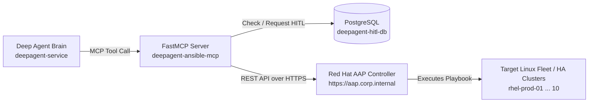

# Red Hat Ansible Automation Platform (AAP) Connectivity & Playbook Mapping Guide

This guide explains:
1. **How Deep Agent connects to your enterprise Ansible Automation Platform (AAP / AWX)**.
2. **How playbooks and job templates work** (moving your playbooks into AAP).
3. **The exact list of 21 Ansible MCP tools and their required AAP Job Template names**.

---

## 1. How Deep Agent Connects to Ansible AAP

Deep Agent communicates with Ansible AAP via **standard REST API calls** using `deepagent-ansible-mcp` on TCP port 8000.



### The API Flow:
1. **Find Template**: `GET https://<AAP_HOST>/api/v2/job_templates?name=<Template_Name>`
2. **Launch Job**: `POST https://<AAP_HOST>/api/v2/job_templates/<id>/launch/` with `extra_vars` (e.g., `{"hostlist": "rhel-node1"}`).
3. **Poll Completion**: `GET https://<AAP_HOST>/api/v2/jobs/<job_id>/` until status is `successful` or `failed`.
4. **Fetch Output**: `GET https://<AAP_HOST>/api/v2/jobs/<job_id>/stdout/?format=txt` to return stdout back to the LLM.

---

## 2. Moving Your Playbooks to AAP (How It Works)

In enterprise Ansible architecture, **Deep Agent does NOT store raw .yml playbook files locally**. 

Instead, playbooks live inside your enterprise **Git Repository** synced to **AAP**:

```text
[Your Git Repo (e.g. GitLab/GitHub)] 
       │ (Contains your .yml playbooks)
       ▼ 
[AAP Project Sync] 
       │
       ▼
[AAP Job Templates] 
       │ (Named e.g. "Patch Fleet", "PCS Node Standby")
       ▲
       │ (Invoked via REST API with extra_vars)
[Deep Agent ansible-mcp]
```

### Steps to Set Up Playbooks in AAP:
1. **Push your Ansible Playbooks to a Git repository** (e.g. `cluster_ops.yml`, `patch_fleet.yml`).
2. In the AAP Web UI, go to **Resources > Projects** and add a Project pointing to that Git repository.
3. In AAP, go to **Resources > Templates** and create a **Job Template** for each playbook.
4. **Important**: In each Job Template settings, check the box:
   **Prompt on launch: Variables** (or allow `extra_vars`), so Deep Agent can pass `hostlist` or `hostname`.

---

## 3. The 21 Job Templates & Variable Names Required by Deep Agent

When Deep Agent decides to run an action, it looks up the template in AAP by its **exact name**.

### High-Risk Maintenance Templates (Requires HITL Approval Gate)

| Tool Function | Exact AAP Job Template Name | Passed Extra Variable(s) | Description |
| :--- | :--- | :--- | :--- |
| `ansible_pcs_node_standby` | **`PCS Node Standby`** | `{"hostname": "node1"}` | Puts Pacemaker cluster node into standby (migrates resources). |
| `ansible_pcs_node_unstandby`| **`PCS Node Unstandby`** | `{"hostname": "node1"}` | Brings node back online in the cluster. |
| `ansible_pcs_cluster_stop` | **`PCS Cluster Stop`** | `{"hostname": "node1"}` | Stops Pacemaker/Corosync cluster software on a node. |
| `ansible_pcs_cluster_start`| **`PCS Cluster Start`** | `{"hostname": "node1"}` | Starts Pacemaker/Corosync cluster software on a node. |
| `ansible_pcs_cluster_disable`| **`PCS Cluster Disable`** | `{"hostname": "node1"}` | Disables cluster services from starting at boot. |
| `ansible_pcs_cluster_enable`| **`PCS Cluster Enable`** | `{"hostname": "node1"}` | Enables cluster services to start at boot. |
| `ansible_patch_fleet` | **`Patch Fleet`** | `{"hostlist": "node1,node2"}` | Runs `dnf update` / security patching across hosts. |
| `ansible_reboot_fleet` | **`Reboot Fleet`** | `{"hostlist": "node1,node2"}` | Reboots a list or wave of servers. |
| `ansible_reboot_host` | **`Reboot Host`** | `{"hostname": "node1"}` | Reboots a single server. |
| `ansible_pcs_maintenance_mode`| **`PCS Maintenance Mode`**| `{"enable": "true"}` | Enables or disables cluster-wide maintenance mode. |
| `ansible_pcs_resource_move`| **`PCS Resource Move`** | `{"resource_id": "vip", "target_node": "node2"}` | Migrates a specific cluster resource group. |
| `ansible_pcs_resource_clear`| **`PCS Resource Clear`**| `{"resource_id": "vip"}` | Clears temporary failover constraints. |
| `ansible_console_power_on` | **`Console Power On`** | `{"hostlist": "node1"}` | Triggers out-of-band IPMI / iLO power cycle for hung nodes. |
| `ansible_vmware_reset` | **`VMware VM Reset`** | `{"vm_name": "vm-rhel-01"}` | Resets VM via VMware vSphere API. |
| `ansible_run_command` | **`Limited Run Any Command`**| `{"hostlist": "node1", "agent_comand": "uptime"}` | Executes a validated ad-hoc shell command. |

### Standard Read-Only / Diagnostic Templates (No HITL Required)

| Tool Function | Exact AAP Job Template Name | Passed Extra Variable(s) | Description |
| :--- | :--- | :--- | :--- |
| `ansible_pcs_health_check` | **`PCS Health Check`** | `{"hostlist": "ha_cluster1"}` | Queries cluster status, quorum, STONITH, and node list. |
| `ansible_pcs_status` | **`PCS Status`** | `{"hostlist": "ha_cluster1"}` | Basic cluster status inspection. |
| `ansible_check_host_online`| **`Check Host Online`** | `{"hostlist": "node1,node2"}` | Probes SSH port 22 and kernel uptime. |
| `ansible_pcs_constraint_list`| **`PCS Constraint List`** | `{"hostname": "node1"}` | Inspects resource location and colocation constraints. |
| `ansible_pcs_cib_upgrade` | **`PCS CIB Upgrade`** | `{"hostname": "node1"}` | Upgrades cluster CIB schema version. |
| `ansible_expand_fs` | **`Expand Filesystem`** | `{"hostname": "node1", "mount_point": "/var"}` | Expands LVM / XFS filesystems. |
| `ansible_install_package` | **`Install Package`** | `{"hostname": "node1", "package_name": "tmux"}` | Installs package via package manager. |
| `ansible_send_email` | **`Send Email Notification`**| `{"recipient": "...", "subject": "...", "body": "..."}` | Dispatches SRE summary reports via AAP mailer. |

---

## 4. Connecting Deep Agent to Your AAP Controller

You can connect Deep Agent to your AAP in 2 ways:

### Method A: Via the Web UI (Port 8443)
1. Open `https://127.0.0.1:8443` and click the **⚙️ Settings** tab.
2. Under **Setting 2: Ansible Automation Platform (AAP / AWX) Integration**:
   - **Execution Backend**: Select `Production Red Hat AAP / AWX Controller`.
   - **AAP Host URL**: `https://<YOUR_AAP_CONTROLLER_HOST>` (e.g. `https://aap.corp.internal`).
   - **OAuth2 Application Token**: Paste your AAP Personal Access Token.
   - **Verify SSL**: Select `Ignore Self-Signed` (if internal CA) or `Verify`.
   - Click **Save AAP Credentials**.
   - Click **⚡ Test AAP Connection** to verify that Deep Agent can reach AAP!

### Method B: Via SQL on the Server Terminal
```bash
podman exec -i deepagent-hitl-db psql -h 127.0.0.1 -U hermes -d hitl << 'EOF'
INSERT INTO system_settings (key, value) VALUES ('aap_backend_mode', 'production')
ON CONFLICT (key) DO UPDATE SET value = EXCLUDED.value;

INSERT INTO system_settings (key, value) VALUES ('aap_host', 'https://aap.corp.internal')
ON CONFLICT (key) DO UPDATE SET value = EXCLUDED.value;

INSERT INTO system_settings (key, value) VALUES ('aap_token', 'BearerYourAAPTokenHere')
ON CONFLICT (key) DO UPDATE SET value = EXCLUDED.value;
EOF
```
