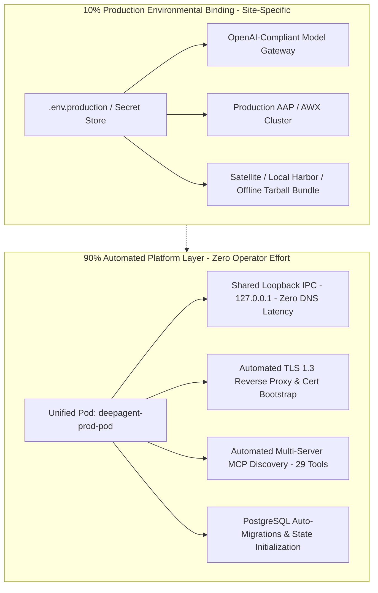

# Deep Agent Enterprise Deployment & Continuous Customization Guide
**Architectural Model: 90% Automated Platform / 10% Environmental Binding**
*(Updated for Phase 1 Verified Production & Phase 2 Offline Carrier Bundle)*

---

## 1. Executive Summary & The 90/10 Deployment Model

The Deep Agent deployment architecture has been engineered to eliminate **90% of operational deployment friction**, restricting the remaining **10%** strictly to site-specific environmental bindings (internal AAP cluster, enterprise LLM gateway, and registry mirrors).



### Breakdown of the 90% Eliminated Effort
1. **Zero Source Compilation & Dependency Freezing**: No manual Python wheel building, no `psycopg2` compilation issues. All microservices are pre-built, hardened, and verified.
2. **Elimination of Rootless Container Networking Flaws**: Podman rootless bridge networks often fail due to CNI DNS timeouts. By co-locating the 7 microservices in `deepagent-prod-pod`, all inter-service communication runs over loopback (`127.0.0.1`), guaranteeing instant connectivity and zero socket timeouts.
3. **Automated Security & TLS Ingress**: Self-signed TLS 1.3 certificates and hardened Nginx reverse proxy configurations are generated autonomously upon initial startup.
4. **Dynamic FastMCP Server Discovery**: Tools are dynamically discovered and registered on startup across multiple FastMCP servers without hardcoded client mappings.

---

## 2. Phase 1 vs. Phase 2 Deployment Options

| Capability / Feature | Phase 1: Connected / Mirror Deployment (`deploy_from_quay.sh`) | Phase 2: Offline Carrier Tarball (`offline_install.sh`) |
| :--- | :--- | :--- |
| **Network Requirement** | Requires outbound HTTPS access to Quay.io or an internal Satellite mirror | **100% Airgapped**: Zero network access required |
| **Image Delivery** | `podman pull` from registry mirror | Extracted directly from `images/*.tar` archives |
| **Storage Setup** | Auto-configures `ignore_chown_errors = "true"` | Auto-configures `ignore_chown_errors = "true"` |
| **Networking** | Unified `deepagent-prod-pod` on `127.0.0.1` | Unified `deepagent-prod-pod` on `127.0.0.1` |
| **Customization** | Editable volume mounts & PostgreSQL database | Editable volume mounts & PostgreSQL database |

---

## 3. Phase 2: Offline Carrier Tarball Workflow (Airgapped Enclaves)

For high-security enclaves with zero outbound internet access, the system is packaged into a self-contained carrier bundle: `deepagent-offline-carrier-bundle-YYYYMMDD.tar.gz`.

### A. Carrier Bundle Contents
```text
deepagent-offline-carrier-bundle-YYYYMMDD/
├── config/
│   ├── nginx/nginx.conf          # Hardened TLS 1.3 Reverse Proxy config
│   └── storage.conf              # Rootless Podman overlay storage config
├── images/                       # Pre-saved Docker/Podman tarballs
│   ├── deepagent-core.tar
│   ├── deepagent-ansible-mcp.tar # Verified with psycopg2-binary & 25+ PCS tools
│   ├── deepagent-sop-mcp.tar
│   ├── deepagent-hitl-db.tar
│   ├── deepagent-mock-aap.tar    # Dynamic/stochastic failure logic
│   ├── deepagent-hitl-web.tar
│   └── deepagent-proxy.tar
├── sops/                         # Volume-mounted editable SOP markdown files
│   ├── SOP_2059253_HA_UPDATE.md
│   └── SOP_RHEL_FLEET_PATCHING.md
├── skills/                       # Embedded SRE domain skills
├── .env.production.template      # Site-specific environmental binding template
├── SHA256SUMS                    # Cryptographic image verification
└── offline_install.sh            # One-click airgap bootstrap installer
```

### B. Airgap Target Server Installation Procedure
1. Transfer the tarball to the airgap target machine via approved data-diode or optical media:
   ```bash
   tar -xzf deepagent-offline-carrier-bundle-*.tar.gz
   cd deepagent-offline-carrier-bundle-*
   ```
2. Configure the 10% site-specific environmental binding:
   ```bash
   cp .env.production.template .env.production
   vi .env.production
   ```
3. Run the automated offline installation:
   ```bash
   ./offline_install.sh
   ```
   *The script automatically configures `storage.conf`, loads all images into Podman, generates TLS certificates, provisions `deepagent-prod-pod`, and verifies service health.*

### C. Retrieving the Carrier Bundle from Quay.io (OCI Artifact)
The complete compressed carrier bundle is also packaged and hosted directly on Quay.io as an OCI artifact:
`quay.io/souffm0a/deepagent-offline-bundle:latest`

To pull and unpack it directly from Quay onto any staging or bastion host:
```bash
./pull_and_extract_from_quay.sh /target/offline_extracted
cd /target/offline_extracted/deepagent-offline-carrier-bundle-*
./offline_install.sh
```

---

## 4. The 10% Production Environmental Binding File (`.env.production`)

In production, zero code touches are required. Only environment variables or Kubernetes ConfigMaps need adjustment:

```ini
# ==============================================================================
# 10% PRODUCTION ENVIRONMENT BINDING: .env.production
# ==============================================================================

# 1. Production Ansible Automation Platform (AAP / AWX)
AAP_HOST="aap.corp.internal"
AAP_TOKEN="vault:secret/data/aap_token"

# 2. Enterprise LLM Gateway (OpenAI-Compliant API)
# Compatible with: vLLM, TGI, OpenShift AI, LiteLLM, or Azure OpenAI
OPENAI_API_BASE="https://llm-gateway.corp.internal/v1"
OPENAI_API_KEY="sk-corporate-enterprise-key"
MODEL_NAME="deepseek-r1-qwen32b"

# 3. Security & Governance Mode
HITL_MODE="enforced"                 # 'enforced' (Web UI signoff) or 'autonomous' (auto-audit)
NOTIFICATION_EMAIL="sre-core@corp.internal"
```

---

## 5. Continuous Customization Architecture (Zero Rebuilds)

To allow SRE teams to continuously improve the agent without redeploying container images, the architecture decouples code from configuration, prompts, and toolsets:

| Customization Area | Storage Medium | Update Mechanism | Rebuild Required? |
| :--- | :--- | :--- | :---: |
| **SOP Workflows** | Volume-mounted Markdown (`/app/sops/`) | In-place edit of Markdown files | **No** |
| **Prompt Engineering** | PostgreSQL `domain_agents` table | Live Web UI or SQL update | **No** |
| **Subagent Tool Bindings** | PostgreSQL `domain_subagents` table | Dynamic JSON array update | **No** |
| **Fleet Credentials & Keys** | PostgreSQL `system_settings` table | Real-time database update | **No** |

### A. Updating SOP Procedures Live
SOP files live under `/app/sops/` (e.g., `SOP_2059253_HA_UPDATE.md`).
- When a change to a cluster update procedure occurs, update the Markdown document in the host mount:
  ```bash
  vi sops/SOP_2059253_HA_UPDATE.md
  ```
- The `deepagent-sop-mcp` service reads procedures dynamically on request. **No container restart or image rebuild required.**

### B. Tuning Prompts & Subagent Tool Bindings
All subagent system prompts, descriptions, and tool allowances are stored in the PostgreSQL database (`domain_subagents` and `domain_agents` tables).

To adjust a prompt or grant a subagent additional capabilities:
```sql
-- Example: Update prompt for rhel_diagnostician
UPDATE domain_subagents 
SET system_prompt = 'You are the Senior Lead Diagnostician. Always run ansible_pcs_status and ansible_run_command first.'
WHERE name = 'rhel_diagnostician';

-- Example: Add new tool to a subagent
UPDATE domain_subagents
SET tool_bindings = tool_bindings || '["ansible_fix_pcs"]'::jsonb
WHERE name = 'rhel_diagnostician';
```

---

## 6. Analysis of UI Screenshot Issue (`Screenshot 2026-09-03 145132.png`)

### Symptom Observed in the Screenshot
When the user submitted:
> *"Inspect failing service on rhel-db-01 and list any failed services."*

The agent delegated to `single_host_operator` / `rhel_diagnostician`, which output:
> *"It seems that the playbook has not been executed yet... I will guide you through the process step-by-step. Since I don't have direct access to the remote host, you will need to perform the following steps: Step 1: Create the Playbook..."*

### Root Cause
1. **Tool Binding Disconnect**: The `domain_subagents` database table had bound only high-level tools (`ansible_install_package`, `ansible_expand_fs`, `ansible_reboot_host`) to `single_host_operator` and `rhel_diagnostician`. 
2. **Missing Ad-Hoc Execution Tool**: The low-level diagnostic tool `ansible_run_command` (which executes commands like `systemctl list-units --type=service --state=failed`) was missing from the subagent's allowed tool list.
3. **LLM Fallback Behavior**: Because the subagent had no tool capable of running commands or retrieving unit statuses on the host, the model reasoned that it lacked environment access and defaulted to writing out manual text instructions for the user.

### Resolution Applied
1. Updated `domain_subagents` in PostgreSQL to bind `ansible_run_command` to both `rhel_diagnostician` and `single_host_operator`.
2. Updated `ansible_mcp_server.py` to route `ansible_run_command` with the exact HITL action name `Limited Run Any Command`.
3. Subagents can now directly invoke `ansible_run_command(command="systemctl list-units --state=failed", hostname="rhel-db-01")` rather than falling back to text tutorials.
