# 🛡️ Enterprise Security Hardening, Zero-Trust Governance & Component Lifecycle Specification

**Document Version**: 2.0.0  
**Classification**: Enterprise Confidential / Production Security Architecture  
**Target Environment**: Air-Gapped Red Hat Enterprise Linux / OpenShift Container Platform  
**Compliance Standards**: NIST SP 800-53, CIS Docker/Podman Benchmarks, OWASP Top 10 for LLMs  

---

## 📖 Executive Summary

This document establishes the **Production Security Hardening Architecture** and **Component Modernization Lifecycle** for the **LangGraph Deep Agent Platform**. It transitions the platform from a development/UAT baseline to a hardened, zero-trust enterprise security posture while upgrading all underlying frameworks and dependencies to their latest production releases.

---

## 🏛️ Defense-in-Depth Security Framework

```mermaid
flowchart TD
    subgraph Layer1_Perimeter["1. Perimeter & Transport Security"]
        TLS["🔒 Mandatory TLS 1.3 / HTTPS Only"]
        CORS["🛡️ Strict CORS Origin Allowlisting (No Wildcards)"]
        RATE["⏱️ API Rate Limiting & Anti-Brute-Force Gateway"]
    end

    subgraph Layer2_Identity["2. Zero-Trust Identity & Access (RBAC)"]
        SCOPED["🔑 Scoped API Bearer Tokens (da_sec_*) with Domain Isolation"]
        RBAC["👥 Role-Based Access Control (Admin, Operator, Service Account)"]
        PASS["🔐 PBKDF2 / Argon2id Password Hashing with Salt"]
        SESS["🕒 Persistent PostgreSQL Session Store with Inactivity Timeout"]
    end

    subgraph Layer3_Runtime_Guardrails["3. Agent Runtime Guardrails & HITL"]
        HITL["🛡️ Mandatory Human-In-The-Loop Breakpoints for Destructive Actions"]
        INJECT["🚫 Pre-LLM Prompt Injection & Command Chaining Sanitizer"]
        WILDCARD["🛑 Destructive Wildcard Blocker (rm -rf, chmod 777, DROP TABLE)"]
    end

    subgraph Layer4_Data_Storage["4. Data, Secrets & Audit Integrity"]
        ENCRYPT["🔐 Secrets Encryption at Rest (AES-256-GCM for AAP tokens, SMTP, API keys)"]
        AUDIT["📜 Append-Only Immutable PostgreSQL Audit Trail"]
        DB_LEAST["🐘 PostgreSQL Least-Privilege Database Role"]
    end

    subgraph Layer5_Container_OS["5. Container & OS Hardening"]
        ROOTLESS["⚙️ Rootless Podman Execution (UID 1001)"]
        DROP_CAPS["🛡️ Drop All Linux Capabilities (--cap-drop=ALL)"]
        READ_ONLY["🔒 Read-Only Container Root Filesystem with tmpfs"]
    end

    subgraph Layer6_Upgrades["6. Component & Dependency Lifecycle"]
        PKGS["📦 Pinned Production Dependency Upgrades (LangGraph, FastAPI, Pydantic)"]
        VULN["🔍 Automated CVE Scanning & Software Bill of Materials (SBOM)"]
    end

    Layer1_Perimeter --> Layer2_Identity --> Layer3_Runtime_Guardrails --> Layer4_Data_Storage --> Layer5_Container_OS --> Layer6_Upgrades
```



---

## 🔒 Part 1: Security Hardening Controls

### 1.1 API Gateway RBAC & Mandatory Route Guards
All administrative, state-mutating, and telemetry endpoints are protected by mandatory token authentication:
- **Protected Routes**:
  - `POST /v1/settings/*` — Changing LLM gateways, AAP credentials, SMTP, or HITL mode requires `admin` role.
  - `POST /v1/studio/*` — Creating agents, editing prompts, or registering MCP servers requires `admin` role.
  - `POST /v1/hitl/cleanup` — Database purging requires `admin` role.
  - `POST /v1/auth/users` — Provisioning user accounts requires `admin` role.
  - `POST /v1/chat/completions` — Requires valid Scoped API Token (`da_sec_*`) or active session.
- **Strict CORS Origin Allowlist**:
  ```python
  # Production app/main.py
  app.add_middleware(
      CORSMiddleware,
      allow_origins=settings.allowed_origins.split(","), # e.g. "https://sre.enterprise.local"
      allow_credentials=True,
      allow_methods=["GET", "POST", "PUT", "DELETE"],
      allow_headers=["Authorization", "Content-Type"],
  )
  ```
- **Rate Limiting Gateway**:
  - Max 60 requests/minute per IP on standard endpoints.
  - Max 5 attempts/minute on `/v1/auth/login` to prevent credential brute-forcing.

---

### 1.2 Persistent PostgreSQL Session Management
Replace ephemeral in-memory session dictionaries with a persistent, database-backed `user_sessions` table:
```sql
CREATE TABLE IF NOT EXISTS user_sessions (
    id SERIAL PRIMARY KEY,
    session_token VARCHAR(64) UNIQUE NOT NULL,
    user_id INT REFERENCES users(id) ON DELETE CASCADE,
    created_at TIMESTAMP WITH TIME ZONE DEFAULT CURRENT_TIMESTAMP,
    last_accessed_at TIMESTAMP WITH TIME ZONE DEFAULT CURRENT_TIMESTAMP,
    expires_at TIMESTAMP WITH TIME ZONE NOT NULL,
    is_revoked BOOLEAN DEFAULT FALSE
);
CREATE INDEX IF NOT EXISTS idx_sessions_token ON user_sessions(session_token);
```
- **Inactivity Timeout**: Sessions automatically expire after **30 minutes of idle inactivity**.
- **Absolute Lifespan**: Maximum session lifespan is **24 hours**.
- **Instant Logout Revocation**: Logging out marks `is_revoked = TRUE` and purges the session.

---

### 1.3 Secrets Encryption at Rest (AES-256-GCM)
Sensitive credentials stored in PostgreSQL (`system_settings` and `mcp_servers`) must be encrypted at rest using AES-256-GCM:
- **Encrypted Fields**:
  - `AAP_TOKEN_PRD`
  - `SMTP_PASSWORD`
  - `CUSTOM_OPENAI_API_KEY`
  - `OPENROUTER_API_KEY` / `GROQ_API_KEY`
- **Encryption Architecture**:
  - Master key loaded via `SYSTEM_ENCRYPTION_KEY` environment variable.
  - Ciphertext stored in format: `enc:v1:<nonce_b64>:<ciphertext_b64>:<tag_b64>`.

---

### 1.4 Pre-LLM Prompt Injection & Command Sanitization
- **Pre-LLM Sanitizer**:
  - Filters out prompt injection payloads attempting instruction overrides, privilege escalation, or access to sensitive files (`/etc/shadow`, `/root`).
- **Ansible MCP Command Sanitizer**:
  - Rejects raw command chaining operators (`&&`, `||`, `;`, `|`, `` ` ``, `$()`) in single-command tools.
  - Enforces mandatory **`Limited Run Any Command`** Human-In-The-Loop approval cards for any free-form shell execution.

---

### 1.5 Rootless Container & Linux OS Hardening
- **Non-Root User Execution**: All containers execute under non-privileged UID `1001` (group `1001`).
- **Capabilities Dropped**: Run with `--cap-drop=ALL` (OpenShift restricted SCC compliant).
- **Read-Only Root Filesystem**: Mount container root as read-only with a temporary memory filesystem (`tmpfs`) on `/tmp` and `/run`.
- **Storage Configuration**: Configure `/etc/containers/storage.conf` with:
  ```ini
  [storage]
  driver = "overlay"

  [storage.options.overlay]
  ignore_chown_errors = "true"
  ```

---

## 📦 Part 2: Component & Dependency Upgrade Matrix

All packages and base images are upgraded to the latest stable production versions:

### **2.1 Production Base Images (Up-to-Date Standard Images)**

| Component | Standard Base Image | Target Latest Production Tag | Security & Performance Rationale |
| :--- | :--- | :--- | :--- |
| **Deep Agent Service** | `python` | `python:3.11-slim` (Latest Patch) | Minimal attack surface, zero unnecessary system packages, up-to-date Debian 12 security patches. |
| **FastMCP Servers** | `python` | `python:3.11-slim` (Latest Patch) | Lightweight FastMCP runtime with updated OpenSSL and minimal binary dependencies. |
| **PostgreSQL DB** | `postgres` | `postgres:16-alpine` (Latest Patch) | Lightweight, secure PostgreSQL 16 engine with automated security patches. |
| **Web UI** | `nginx` | `nginx:alpine-slim` (Latest Patch) | Hardened, minimal unprivileged Nginx reverse proxy. |

---

### **2.2 Python Framework & Library Upgrades (`requirements.txt`)**

| Package Name | Minimum Pinned Version | Upgraded Latest Stable | Key Security & Performance Improvements |
| :--- | :--- | :--- | :--- |
| **`deepagents`** | `0.7.0` | **`latest (>=0.8.2)`** | Enhanced subagent recursion handling and graph reflection stability. |
| **`langgraph`** | `0.2.x` | **`latest (>=0.2.28)`** | Native async streaming updates, memory checkpoint performance. |
| **`langchain`** | `0.3.x` | **`latest (>=0.3.7)`** | Pydantic v2 core optimizations, streaming token safety. |
| **`langchain-openai`** | `0.2.x` | **`latest (>=0.2.5)`** | Standard OpenAI SDK v1.50+ compatibility for internal gateways. |
| **`langchain-mcp-adapters`** | `0.0.x` | **`latest (>=0.1.2)`** | Native Streamable HTTP and SSE FastMCP protocol support. |
| **`mcp`** | `1.0.x` | **`latest (>=1.1.0)`** | Official Model Context Protocol SDK with connection timeout guards. |
| **`fastapi`** | `0.115.x` | **`latest (>=0.115.4)`** | Pydantic v2 validation speedups and strict security dependency injection. |
| **`uvicorn[standard]`** | `0.32.x` | **`latest (>=0.32.0)`** | High-performance ASGI server with HTTP/2 and TLS 1.3 support. |
| **`pydantic`** | `2.9.x` | **`latest (>=2.9.2)`** | Rust-based input validation eliminating deserialization vulnerabilities. |
| **`pydantic-settings`** | `2.5.x` | **`latest (>=2.6.0)`** | Strongly-typed environment parsing with secret masking. |
| **`httpx`** | `0.27.x` | **`latest (>=0.27.2)`** | Modern async HTTP client with connection pooling and backoff retries. |
| **`psycopg2-binary`** | `2.9.9` | **`latest (>=2.9.10)`** | Hardened PostgreSQL client driver with connection leak prevention. |
| **`cryptography`** | *Added* | **`latest (>=43.0.3)`** | Industry-standard AES-256-GCM authenticated encryption engine. |
| **`passlib[argon2]`** | *Added* | **`latest (>=1.7.4)`** | Memory-hard password hashing engine resisting GPU brute-force. |

---

## 🛠️ Part 3: Implementation Verification & Audit Battery

| Test ID | Security / Component Target | Execution Procedure | Acceptance Criteria |
| :--- | :--- | :--- | :--- |
| **`SEC-01`** | **RBAC Route Protection** | Send `POST /v1/settings/hitl_mode` without authorization header. | Returns **`HTTP 401 Unauthorized`**. |
| **`SEC-02`** | **Brute-Force Rate Limiting** | Issue 10 rapid failed login requests to `/v1/auth/login`. | Returns **`HTTP 429 Too Many Requests`**. |
| **`SEC-03`** | **Secrets Encryption at Rest**| Query PostgreSQL `system_settings` table directly for AAP/SMTP tokens. | Values stored as AES-256-GCM ciphertext (`enc:v1:...`). |
| **`SEC-04`** | **Session Inactivity Timeout** | Create session $\rightarrow$ simulate 31m idle $\rightarrow$ call `/v1/auth/me`. | Returns **`HTTP 401 Unauthorized (Session Expired)`**. |
| **`SEC-05`** | **Command Injection Defense** | Send `echo ok; rm -rf /` to `ansible_run_command`. | Sanitizer rejects command chaining; requires HITL. |
| **`SEC-06`** | **Component Version Audit** | Run `pip list` inside container. | All packages match or exceed target version matrix. |

---

## 🚀 Execution Roadmap

1. **Step 1**: Update `requirements.txt` with modernized, pinned dependencies and install `cryptography` + `argon2`.
2. **Step 2**: Implement `SecretVault` (AES-256-GCM) in `app/infrastructure/security/vault.py`.
3. **Step 3**: Upgrade `AuthRepository` with persistent `user_sessions` schema, idle timeout, and route-level RBAC decorators.
4. **Step 4**: Apply security middleware (Rate limiting, strict CORS, Pre-LLM prompt sanitizer) in `app/main.py`.
5. **Step 5**: Execute the **Security & Upgrade Audit Battery (`SEC-01` to `SEC-06`)** and compile verification logs.
