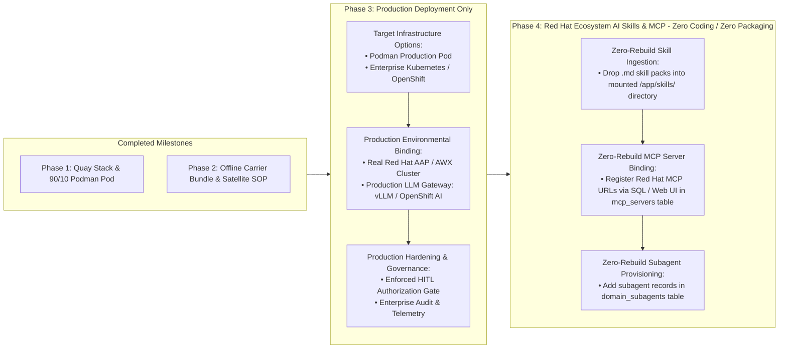

# Architecture & Roadmap: Phase 3 (Production Deployment) & Phase 4 (Red Hat Ecosystem AI Skills)

This document establishes the official roadmap and execution plan separating **Production Deployment** (Phase 3) from **Red Hat Ecosystem AI Skills & MCP Ingestion** (Phase 4).

---

## 1. Roadmap Overview & Strategic Separation



---

## 2. Phase 3: Production Deployment Only (Detailed Plan)

The primary goal of Phase 3 is to deploy the verified 7-microservice Deep Agent stack into the live enterprise environment and connect it to real production infrastructure.

### Phase 3 Deliverables & Scope

| Workstream | Scope & Objectives | Implementation Details |
| :--- | :--- | :--- |
| **3.1 Infrastructure Deployment Options** | Deploy the production stack via one of two supported enterprise topologies: | **Option A (RHEL Server / VM)**: Single Podman Pod (`deepagent-prod-pod`) via `deploy_from_quay.sh` or `offline_install.sh`.<br>**Option B (Kubernetes / OpenShift / VMware Tanzu)**: Production Helm / Kustomize manifests reflecting the 7 microservices. |
| **3.2 Production Fleet & AAP Binding** | Switch from `mock-aap` to the enterprise **Red Hat Ansible Automation Platform (AAP / AWX)**. | Configure `AAP_HOST`, `AAP_TOKEN`, and verify job template bindings (`PCS Node Standby`, `Patch Fleet`, `Limited Run Any Command`, etc.). |
| **3.3 Enterprise LLM Gateway Integration** | Connect to production on-premise or cloud LLM inference endpoints. | Configure `OPENAI_API_BASE`, `OPENAI_API_KEY`, and `MODEL_NAME` (e.g. vLLM serving DeepSeek-R1 / Llama-3-70B, OpenShift AI, or Azure OpenAI). |
| **3.4 Enforced HITL Security Mode** | Transition security gate from simulation mode (`autonomous`) to enterprise operator mode (`enforced`). | All high-risk cluster and reboot tools trigger visual approval modals in the SRE Web UI (`https://<host>:8443`) before execution. |
| **3.5 Production Verification & Sign-off** | Execute live smoke test and telemetry verification on real target hosts. | Verify database persistence, TLS cert validity, AAP job launches, and email notifications. |

---

## 3. Phase 4: Red Hat Ecosystem Skills & MCP Ingestion (Detailed Plan)

Phase 4 focuses on expanding Deep Agent's cognitive capabilities using the **Red Hat AI Ecosystem Catalog** (`catalog.redhat.com/en/ai/skills`).

> [!IMPORTANT]
> **Zero Coding & Zero Packaging Architecture Guarantee**:
> Phase 4 requires **0 lines of Python code changes** and **0 container image rebuilds**.
> Because Deep Agent decouples knowledge (skills), tools (MCP servers), and cognitive personas (subagents) from the core engine:
> 1. **Skills**: Dropped as `.md` files directly into the host volume mount (`/app/skills/`).
> 2. **MCP Servers**: Registered dynamically as URL endpoints in the PostgreSQL `mcp_servers` table.
> 3. **Subagents**: Configured dynamically via JSON records in the PostgreSQL `domain_subagents` table.

### Phase 4 Deliverables & Scope (Zero-Rebuild Operations)

| Workstream | Scope & Objectives | How It Works (Zero Code / Zero Packaging) |
| :--- | :--- | :--- |
| **4.1 Ingestion of Certified Agentic Skills** | Import official Red Hat markdown skills into the decoupled `/app/skills/` volume. | **Pure File Drop**: Copy downloaded `.md` skill files into the volume-mounted folder on the host (e.g. `deepagent_system/skills/rhel_cve/skill.md`). The engine reads them directly on the next turn. |
| **4.2 Certified Red Hat MCP Servers** | Connect official Red Hat FastMCP servers to `MultiServerMCPClient`. | **Pure Database Insert**: Insert the Red Hat MCP URL into PostgreSQL: `INSERT INTO mcp_servers (name, url) VALUES ('rh_insights', 'http://insights-mcp:8000/mcp');`. Loaded dynamically on next query. |
| **4.3 Subagent Capability Expansion** | Register new specialized subagents in PostgreSQL. | **Pure SQL / UI Record**: Insert a new persona row in `domain_subagents` linking the skill path and allowed tool list. Instant activation. |
| **4.4 Validation & Benchmark Testing** | Benchmark agent performance with official Red Hat skills. | Run automated test scenarios comparing standard tool execution against certified Red Hat skill execution. |

---

## 4. Phase 3 Step-by-Step Implementation Roadmap

```text
┌─────────────────────────────────────────────────────────────────────────────┐
│                       PHASE 3 EXECUTION PHASES                              │
├─────────────────────────────────────────────────────────────────────────────┤
│ Step 3.1: Production Configuration Profile (.env.production)                │
│           Define target AAP host, bearer token, LLM gateway, and HITL mode. │
├─────────────────────────────────────────────────────────────────────────────┤
│ Step 3.2: Production Manifest Preparation (Podman & Kubernetes)             │
│           Lock production manifests in `production/podman/` and `staging/k8s/`.│
├─────────────────────────────────────────────────────────────────────────────┤
│ Step 3.3: Production AAP & Tool Validation                                  │
│           Verify that the 25+ Ansible MCP tools map cleanly to AAP templates│
│           in the customer's production AAP environment.                     │
├─────────────────────────────────────────────────────────────────────────────┤
│ Step 3.4: Enforced HITL Authorization Validation                            │
│           Verify the human approval workflow via the Web UI on Port 8443.   │
├─────────────────────────────────────────────────────────────────────────────┤
│ Step 3.5: Final Production Smoke Test & Sign-off                            │
│           Perform real infrastructure discovery, health checks, and reports.│
└─────────────────────────────────────────────────────────────────────────────┘
```
