# Master Plan: Phase 3 — Production Deployment Only

This document establishes the dedicated execution plan for **Phase 3: Production Deployment Only**. All cognitive skill expansion and Red Hat catalog ingestion are strictly separated into Phase 4.

---

## Phase 3 Execution Lifecycle

```mermaid
flowchart TD
    subgraph P3_Progress [Phase 3 Progress]
        S31[Step 3.1: Air-Gapped Infrastructure Deployment<br/>🟢 COMPLETED: Podman pod live on target host]
        S32[Step 3.2: Production Environmental Binding<br/>🟢 COMPLETED: Enterprise Gateway & TLS Validated]
        S33[Step 3.3: Production LLM Health Probe Real-Check<br/>⚪ Fix supervisor probe to genuinely test OpenAI/vLLM endpoint]
        S34[Step 3.4: Production AAP Tool & Playbook Mapping<br/>🟢 COMPLETED: 25/25 FastMCP tools verified & playbooks dispatched]
        S35[Step 3.5: Enforced HITL Authorization Gate<br/>🟢 COMPLETED: Verified approval modals in Web UI]
        S36[Step 3.6: Database Cleanup of Seeded Historical Sessions<br/>⚪ Purge development mock sessions shipped in init.sql]
        S37[Step 3.7: Production Acceptance & Sign-off<br/>⚪ Live fleet health discovery, rolling patch run, & email audit]
        S38[Step 3.8: Heterogeneous Multi-Model Swarm Investigation<br/>⚪ Benchmark deepseek-v4, GLM-5.3 Flash & Qwen-27B routing]
        S39[Step 3.9: Troubleshooting Guide Review & Persistence Audit<br/>⚪ Verify all retention mechanisms ensure zero customization loss]
        S31 --> S32 --> S33 --> S34 --> S35 --> S36 --> S37 --> S38 --> S39
    end
```



---

## Detailed Deliverables & Workstreams

| Step | Workstream | Objectives & Scope | Implementation Details |
| :--- | :--- | :--- | :--- |
| **3.1** | **Air-Gapped Pod Deployment** | Deploy and verify the 8-container pod in enterprise rootless Podman. | **Status: 🟢 COMPLETED**.<br>Stack deployed. PostgreSQL TCP in memory, TLS 1.3 reverse proxy operational on `https://127.0.0.1:8443`. |
| **3.2** | **Production Environmental Binding** | Bind stack to enterprise infrastructure. | **Status: 🟢 COMPLETED**.<br>Connected to enterprise AI Gateway over TLS with strict CA certificate injection (`verify_mode=2`). Core chat completions validated. |
| **3.3** | **LLM Health Probe Real-Check** | Fix false positive "Online" LLM health reporting. | In `deepagent_system/app/supervisor.py`, replace `return True` for non-Ollama providers with a real HTTP probe to `{OPENAI_API_BASE}/models` or an options ping with timeout. |
| **3.4** | **Production AAP Playbook Mapping** | Validate FastMCP tool execution against real AAP job templates. | **Status: 🟢 COMPLETED**.<br>All 25 operational tools verified passing (25/25), ad-hoc stdout fixed, and 11 core playbooks packaged & delivered. |
| **3.5** | **Enforced HITL Security Gate** | Validate human-in-the-loop authorization. | **Status: 🟢 COMPLETED**.<br>Verified HITL approval gate: agent prompts operator in Web UI, waits for authorization, and consumes approved requests. |
| **3.6** | **Purge Shipped Development Sessions & Audit** | Clean out development test conversations and mock histories shipped in container image. | Run database cleanup query on `deepagent-hitl-db` to truncate `session_threads`, `chat_messages`, and `hitl_requests` while preserving core system settings and admin accounts. |
| **3.7** | **Final Smoke Test & Production Sign-off** | Execute live smoke test and telemetry verification on real target hosts. | Verify cluster status, automated email dispatch to operator, and audit logging in PostgreSQL. |
| **3.8** | **Heterogeneous Multi-Model Swarm Investigation** | Formulate and benchmark dynamic multi-model routing across available gateway models. | Evaluate routing primary supervisor reasoning through `deepseek-v4`, lightweight tasks/telemetry to `zai-org/GLM-5.3 Flash`, and maintenance work to `Qwen/Qwen3.8-27B`. Implement automatic failover and per-subagent dynamic model binding in PostgreSQL. |
| **3.9** | **Troubleshooting Guide Review & Persistence Audit** | Audit all 13 documented fixes and verify retention guarantees across restarts. | Review `AIRGAP_TROUBLESHOOTING_LOG_AND_FIXES.md` retention matrix. Confirm container recreations (`podman rm`), host reboots, and storage driver configs maintain TLS CAs, DB volumes, and AAP template bindings without regression. |

---

## Step 3.6 Implementation Detail: Database Session Cleanup

The container image `quay.io/souffm0a/deepagent-hitl-db:latest` came pre-seeded with historical development conversations.

### Cleanup SQL Script:
```sql
-- Connect to hitl database as hermes
-- Preserves: users, roles, system_settings, mcp_servers, domain_subagents
-- Purges: all development conversation histories, test audit traces, and mock approvals

BEGIN;
TRUNCATE TABLE chat_messages CASCADE;
TRUNCATE TABLE session_threads CASCADE;
TRUNCATE TABLE hitl_requests CASCADE;
TRUNCATE TABLE audit_log CASCADE;
COMMIT;
```

---

## Step 3.3 Implementation Detail: Real LLM Health Check Probe

### Current Behavior:
In `supervisor.py` lines 99–107:
```python
async def _check_llm(self) -> bool:
    if settings.llm_provider == "ollama":
        ...
    return True  # <-- Returns True blindly for OpenRouter/OpenAI without checking!
```

### Required Fix:
Perform an active HTTP probe to verify network reachability:
```python
async def _check_llm(self) -> bool:
    if settings.llm_provider == "ollama":
        url = f"{settings.ollama_host}/api/tags"
    else:
        # Probe OpenAI / vLLM gateway endpoint
        base_url = settings.openai_api_base.rstrip("/")
        url = f"{base_url}/models"
    
    try:
        headers = {}
        if settings.openai_api_key:
            headers["Authorization"] = f"Bearer {settings.openai_api_key}"
        async with httpx.AsyncClient(timeout=3.0) as client:
            resp = await client.get(url, headers=headers)
            return resp.status_code in [200, 401, 403]  # 401/403 proves gateway is reachable
    except Exception:
        return False
```

---

## Step 3.8 Implementation Detail: Heterogeneous Multi-Model Swarm

### Objectives:
1. **Dynamic Model Routing Matrix:**
   - **`deepseek-v4`**: Primary supervisor agent harness (`get_agent("linux_sre")`), responsible for deep reasoning, incident breakdown, tool selection, and HITL authorization decisions.
   - **`zai-org/GLM-5.3 Flash`**: High-frequency, low-latency telemetry subagents (`event_batcher`, `rhel_diagnostician`, `Check Host Online`).
   - **`Qwen/Qwen3.8-27B`**: Dedicated operational execution subagent (`fleet_patcher`, `ha_cluster_patcher`).
2. **PostgreSQL Configuration Schema:**
   - Extend `domain_agents.subagents` JSON schema to pass dedicated `model_name` and `model_provider` parameters per subagent into `create_deep_agent(...)`.
3. **Resilience & Fallback Policies:**
   - Configure automatic fallback to secondary model if the primary model encounters gateway timeouts or rate limits.
