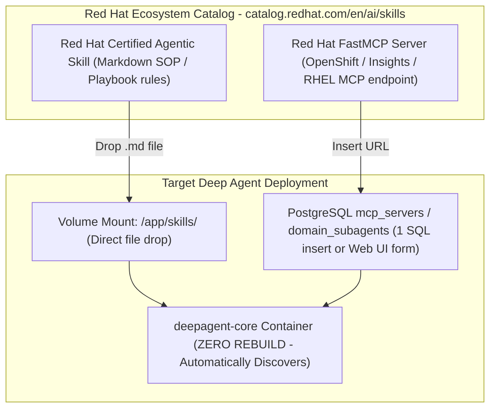

# Master Plan: Phase 4 — Red Hat Ecosystem AI Skills & MCP Ingestion

This document establishes the dedicated execution plan for **Phase 4: Red Hat Ecosystem AI Skills & MCP Ingestion** (catalog.redhat.com/en/ai/skills).

---

## Strategic Constraint: Zero Coding & Zero Packaging Guarantee

> [!IMPORTANT]
> **Zero Coding & Zero Container Repackaging Guarantee**:
> Phase 4 requires **0 lines of Python code changes** and **0 container image rebuilds**.
> 
> Because Deep Agent is architected with a decoupled 90/10 structure:
> 1. **Skills (90%)**: Stored as markdown .md files in /app/skills/ on the host volume mount. The LangChain agent engine parses them on demand.
> 2. **Tools (FastMCP)**: Registered dynamically as URL endpoints via SQL / Web UI in the PostgreSQL mcp_servers table.
> 3. **Subagents**: Configured dynamically via JSON/SQL records in the PostgreSQL domain_subagents table.

---

## Phase 4 Architecture & Ingestion Flow



---

## Phase 4 Deliverables & Workstreams

| Step | Workstream | Objectives & Scope | How It Works (Zero Code / Zero Packaging) |
| :--- | :--- | :--- | :--- |
| **4.1** | **Ecosystem Skill Discovery & Mapping** | Survey and select target skills from catalog.redhat.com/en/ai/skills (e.g., RHEL CVE Remediator, OpenShift Health Check, Satellite Content Syncer). | Identify target skills relevant to Linux SRE and HA cluster management. |
| **4.2** | **Zero-Rebuild Skill Ingestion** | Ingest markdown skill definitions into the host-mounted /app/skills/ directory. | **Pure File Drop**: Copy downloaded .md files into the skills folder on the host. The agent engine automatically discovers them without restarting containers. |
| **4.3** | **Dynamic Red Hat MCP Server Registration** | Register external Red Hat FastMCP server endpoints. | **Pure Database Insert**: Register via Web Console Studio UI or run: `INSERT INTO mcp_servers (server_name, sse_url, domain_scope, is_enabled) VALUES ('rh_insights', 'http://insights.internal:8000/mcp', 'linux', true);`. MultiServerMCPClient discovers and binds all tools dynamically. |
| **4.4** | **Domain Persona & Subagent Provisioning** | Configure specialized subagents for the ingested skills. | **Pure SQL / Web UI Record**: Add a record into domain_subagents table specifying the persona prompt, skill file link, and allowed tool names. |
| **4.5** | **Benchmark & Evaluation Suite** | Verify execution accuracy of ingested Red Hat skills against baseline operations. | Execute benchmark test cases (e.g. CVE mitigation, OpenShift node cordoning) to validate adherence to Red Hat certified standards. |

---

## Operational Workflow for Ingesting a New Skill in Phase 4

```bash
# 1. Download official skill from Red Hat Catalog
curl -s -O https://catalog.redhat.com/skills/rhel_cve_mitigation.md

# 2. Drop into host skills directory
cp rhel_cve_mitigation.md /opt/td-agent/skills/

# 3. Register specialized subagent in PostgreSQL (Optional)
podman exec -i deepagent-hitl-db psql -h 127.0.0.1 -U hermes -d hitl << 'EOF'
INSERT INTO domain_subagents (agent_key, display_name, domain_category, system_prompt, allowed_tools)
VALUES (
  'rhel_cve_specialist',
  'RHEL CVE Remediation Specialist',
  'linux',
  'You are a certified Red Hat security specialist following SOP /app/skills/rhel_cve_mitigation.md.',
  ARRAY['ansible_patch_fleet', 'ansible_check_host_online', 'ansible_reboot_fleet']
);
EOF

# 4. Instant activation - The agent is immediately live in the Web UI domain switcher!
```
