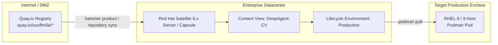

# SOP: Mirroring Deep Agent Container Images via Red Hat Satellite 6.x / Capsule

This standard operating procedure (SOP) provides step-by-step instructions for Red Hat Satellite administrators to synchronize, manage, and publish the 7 Deep Agent microservices from Quay.io into an enterprise internal container catalog.

---

## 1. Overview & Architecture

In disconnected or restricted enterprise environments, Red Hat Satellite serves as the internal mirror for container images:



### Deep Agent Image Inventory
The following 7 images must be mirrored:
1. `quay.io/souffm0a/deepagent-core:latest`
2. `quay.io/souffm0a/deepagent-ansible-mcp:latest`
3. `quay.io/souffm0a/deepagent-sop-mcp:latest`
4. `quay.io/souffm0a/deepagent-hitl-db:latest`
5. `quay.io/souffm0a/deepagent-mock-aap:latest`
6. `quay.io/souffm0a/deepagent-hitl-web:latest`
7. `quay.io/souffm0a/deepagent-proxy:latest`
*(Optional OCI Carrier Bundle)*: `quay.io/souffm0a/deepagent-offline-bundle:latest`

---

## 2. Prerequisites
1. Administrator or Content Manager access to Red Hat Satellite (CLI tool `hammer` or Satellite Web UI).
2. Outbound HTTPS (TCP port 443) from the Satellite server to `quay.io` and `cdn.quay.io`.
3. Valid Quay.io credentials or read access to the repository (`souffm0a`).

---

## 3. Command-Line Procedure (Using `hammer` CLI)

Run the following commands on the **Red Hat Satellite Server**:

### Step 1: Create the Custom Product
Create a product dedicated to hosting the Deep Agent images under your organization:

```bash
ORGANIZATION="Your_Org_Name"  # e.g., "Default Organization" or "Enterprise"

hammer product create \
  --name "DeepAgent" \
  --description "Deep Agent Autonomous Linux SRE Microservices" \
  --organization "${ORGANIZATION}"
```

---

### Step 2: Create Container Image Repositories in Satellite
Create a container repository for each microservice under the `DeepAgent` product:

```bash
IMAGES=(
  "deepagent-core"
  "deepagent-ansible-mcp"
  "deepagent-sop-mcp"
  "deepagent-hitl-db"
  "deepagent-mock-aap"
  "deepagent-hitl-web"
  "deepagent-proxy"
)

for img in "${IMAGES[@]}"; do
  echo "Creating repository for ${img}..."
  hammer repository create \
    --name "${img}" \
    --product "DeepAgent" \
    --content-type "docker" \
    --url "https://quay.io" \
    --docker-upstream-name "souffm0a/${img}" \
    --organization "${ORGANIZATION}"
done
```

> [!NOTE]
> If authentication is required for private repositories, pass `--upstream-username <USER>` and `--upstream-password <TOKEN>` to `hammer repository create`.

---

### Step 3: Synchronize Images from Quay.io to Satellite
Trigger an immediate synchronization for all 7 repositories:

```bash
for img in "${IMAGES[@]}"; do
  echo "Syncing ${img} from quay.io..."
  hammer repository synchronize \
    --product "DeepAgent" \
    --name "${img}" \
    --organization "${ORGANIZATION}" \
    --async
done
```

To monitor sync task progress:
```bash
hammer task list --search "label = Actions::Katello::Repository::Sync"
```

---

### Step 4: Create and Publish a Content View (CV)
Package the synchronized images into a Satellite Content View:

```bash
# 1. Create the Content View
hammer content-view create \
  --name "DeepAgent_CV" \
  --description "Content view containing Deep Agent production container images" \
  --organization "${ORGANIZATION}"

# 2. Add all repositories to the Content View
for img in "${IMAGES[@]}"; do
  REPO_ID=$(hammer repository info --product "DeepAgent" --name "${img}" --organization "${ORGANIZATION}" --fields id | awk '{print $2}')
  hammer content-view component add \
    --content-view "DeepAgent_CV" \
    --component-content-view-id "${REPO_ID}" \
    --organization "${ORGANIZATION}" 2>/dev/null || \
  hammer content-view docker add-repository \
    --name "DeepAgent_CV" \
    --docker-repository-id "${REPO_ID}" \
    --organization "${ORGANIZATION}"
done

# 3. Publish the Content View (Version 1.0)
hammer content-view publish \
  --name "DeepAgent_CV" \
  --description "Initial publish of Deep Agent container stack" \
  --organization "${ORGANIZATION}"
```

---

### Step 5: Promote Content View to Production Lifecycle Environment
Promote the Content View from `Library` to the target environment (e.g., `Production`):

```bash
hammer content-view version promote \
  --content-view "DeepAgent_CV" \
  --version "1.0" \
  --to-lifecycle-environment "Production" \
  --organization "${ORGANIZATION}"
```

---

## 4. Web UI Alternative Procedure (Satellite Web Console)

If using the Satellite graphical console:

1. **Create Product**:
   - Navigate to **Content** > **Products** > Click **Create Product**.
   - Name: `DeepAgent`, Organization: `<Your_Org>`. Click **Save**.
2. **Create Repositories**:
   - Inside the `DeepAgent` product, click **New Repository**.
   - Type: `docker`.
   - Upstream URL: `https://quay.io`.
   - Upstream Repository Name: `souffm0a/deepagent-core` (repeat for all 7 images).
3. **Synchronize**:
   - Select all repositories > Click **Sync Now**.
4. **Content Views**:
   - Go to **Content** > **Content Views** > Click **Create Content View**.
   - Name: `DeepAgent_CV`.
   - Under **Docker Content**, add the 7 synchronized repositories.
   - Click **Publish New Version**, then click **Promote** to your `Production` environment.

---

## 5. Target Server Configuration & Deployment

On the target RHEL server in your production datacenter:

### Step 1: Login to Red Hat Satellite Container Registry
```bash
SATELLITE_FQDN="satellite.corp.internal"
podman login "${SATELLITE_FQDN}"
```

### Step 2: Deploy Using Satellite Registry Path
Update the `REGISTRY` variable in `deploy_from_quay.sh` (or pass it as an environment override):

```bash
# Example Satellite Container Registry URL format:
# <satellite_fqdn>/<organization>-<environment>-<content_view>-<product>-<repository>
SATELLITE_REGISTRY="${SATELLITE_FQDN}/your_org-production-deepagent_cv-deepagent"

REGISTRY="${SATELLITE_REGISTRY}" TAG="latest" ./deploy_from_quay.sh
```

---

## 6. Automated Periodic Sync Schedule (Cron / Sync Plan)
To ensure that patches and new tags are mirrored automatically:

```bash
hammer sync-plan create \
  --name "DeepAgent_Weekly_Sync" \
  --interval "weekly" \
  --sync-date "$(date +%Y-%m-%d) 02:00:00" \
  --enabled true \
  --organization "${ORGANIZATION}"

hammer product set-sync-plan \
  --name "DeepAgent" \
  --sync-plan "DeepAgent_Weekly_Sync" \
  --organization "${ORGANIZATION}"
```
