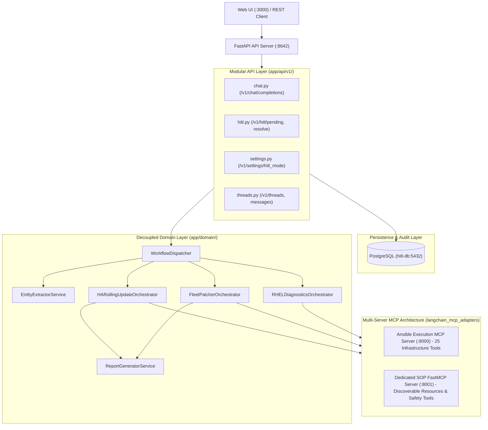

# Deep Agent System Architecture & Operations Runbook

## 1. System Architecture Overview

The **Deep Agent System** is a production-grade, autonomous Site Reliability Engineering (SRE) platform built on LangGraph, FastAPI, and the Model Context Protocol (MCP). It executes automated, high-risk infrastructure lifecycles—such as zero-downtime rolling kernel updates on High Availability (HA) Pacemaker clusters and enterprise standalone fleet patching—with Human-in-the-Loop (HITL) safety guardrails.



---

## 2. Multi-Server Model Context Protocol (MCP) Topology

The system uses LangChain's `MultiServerMCPClient` to connect to multiple specialized FastMCP servers simultaneously over Streamable HTTP:

### 1. Ansible Execution Server (`deepagent-ansible-mcp:8000`)
- **Role**: The "Hands" of the platform. Interacts with AAP/AWX playbooks, sends SSH commands, modifies cluster nodes, and queries infrastructure state.
- **Key Tools**:
  - `ansible_pcs_node_standby`, `ansible_pcs_node_unstandby`
  - `ansible_patch_fleet`, `ansible_reboot_fleet`
  - `ansible_check_host_online`, `ansible_console_power_on`
  - `ansible_send_email`, `ansible_pcs_health_check`

### 2. Dedicated SOP Knowledge Server (`deepagent-sop-mcp:8001`)
- **Role**: The "Brain & Compliance Guide" of the platform. Hosts operational runbooks and evaluates safety criteria.
- **Exposed FastMCP Resources**:
  - `sop://catalog`: Catalog of all registered enterprise procedures.
  - `sop://rhel/ha/2059253`: Red Hat HA Pacemaker Rolling Update Markdown SOP.
  - `sop://rhel/fleet/patching`: Enterprise Fleet Patching Markdown SOP.
  - `sop://rhel/recovery/console`: Out-of-Band IPMI Recovery Markdown SOP.
- **Exposed FastMCP Tools**:
  - `sop_get_procedure(sop_id)`: Fetches execution stages and checklists.
  - `sop_validate_prerequisites(sop_id, precheck_stdout)`: Evaluates cluster health stdout against quorum and STONITH safety rules.
  - `sop_generate_execution_plan(sop_id, entities, hitl_mode)`: Computes execution graphs and upfront authorization needs.

---

## 3. Configuration Management (`app/config.py`)

Configured centrally using **Pydantic v2 Settings** (`pydantic_settings.BaseSettings`):
- `API_PORT` (default: `8642`)
- `API_SERVER_KEY` (default: `hermes-api-secret`)
- `OLLAMA_HOST` (default: `http://ollama:11434`)
- `ANSIBLE_MCP_URL` (default: `http://deepagent-ansible-mcp:8000/mcp`)
- `SOP_MCP_URL` (default: `http://deepagent-sop-mcp:8001/mcp`)
- `DATABASE_URL` (default: `postgresql://hermes:secret456@db:5432/hitl`)
- `ANSIBLE_BACKEND_MODE` (`mock` or `prd`)

---

## 4. How to Add a New Operational SOP

Adding a new standard operating procedure is completely decoupled and takes 3 simple steps:

1. **Register the SOP in `deepagent_system/sop_mcp_server/server.py`:**
   Add entry to `SOP_CATALOG` with its stages, prerequisites, and resource URI.
2. **Implement the Workflow Orchestrator in `app/domain/orchestrators/<new_sop>.py`:**
   Create a dedicated orchestrator class that sequences the FastMCP tool calls.
3. **Register Route in `app/domain/orchestrators/workflow_dispatcher.py`:**
   Add the intent detection branch in `WorkflowDispatcher.dispatch()`.

---

## 5. Verification & Testing

To run the full end-to-end verification test suite across all phases:

```bash
python3 deepagent_system/tests/run_all_verification_tests.py
```
