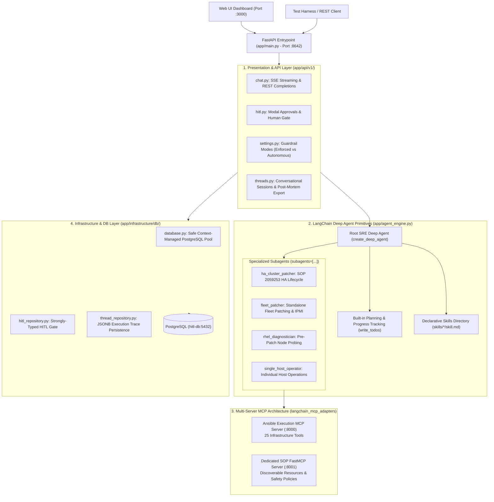

# LangGraph Deep Agent: Complete Technical & User Documentation

---

## 1. System Architecture & High-Level Design

The **LangGraph Deep Agent** is an enterprise-grade autonomous Site Reliability Engineering (SRE) orchestration platform designed for mission-critical infrastructure lifecycle operations (e.g., Red Hat HA Pacemaker/Corosync zero-downtime rolling updates and enterprise standalone fleet patching).

The platform strictly aligns with the official **LangChain Deep Agents** harness specification (`deepagents`, `create_deep_agent`), powered by **FastAPI**, **LangGraph**, **FastMCP / Model Context Protocol**, and **PostgreSQL**.

### System Architecture Diagram



---

## 2. Directory & File Structure

```text
/home/fayez/agent2/
├── AGENTS.md                                # Root operational agent constraints & HITL mandate
├── SOP_RHEL_FLEET_PATCHING.md               # Standard Operating Procedure for Fleet Patching
├── SOUL.md                                  # Agent core identity and SRE behavioral directives
├── deepagents_architecture_refactoring_plan.md # Deep Agents architecture plan
│
├── deepagent_system/                        # Production Deep Agent System
│   ├── skills/                              # Declarative Deep Agent Skills (Progressive Disclosure)
│   │   ├── rhel_ha_patching/skill.md        # YAML frontmatter + SOP 2059253 instructions
│   │   ├── fleet_patching/skill.md          # YAML frontmatter + batch fleet patching SOP
│   │   ├── rhel_diagnostics/skill.md        # YAML frontmatter + cluster triage SOP
│   │   └── single_host_ops/skill.md         # YAML frontmatter + single-host operations SOP
│   │
│   ├── legacy_orchestrators_backup/         # Archived legacy orchestrators (Emergency Backup)
│   │   ├── fleet_patcher.py
│   │   ├── ha_rolling_update.py
│   │   ├── rhel_diagnostics.py
│   │   ├── single_host_ops.py
│   │   └── workflow_dispatcher.py
│   │
│   ├── app/
│   │   ├── main.py                          # Lean FastAPI ASGI entrypoint (<45 lines)
│   │   ├── config.py                        # Centralized Pydantic v2 Settings configuration
│   │   ├── agent_engine.py                  # LangGraph Deep Agent Engine (create_deep_agent)
│   │   ├── mcp_client.py                    # MultiServerMCPClient manager for :8000 and :8001
│   │   ├── prompts.py                       # Root agent and specialized subagent system prompts
│   │   │
│   │   ├── api/v1/                          # Modular FastAPI Routers
│   │   │   ├── chat.py                      # SSE live streaming & token pacing (1.2s delay)
│   │   │   ├── hitl.py                      # /v1/hitl/pending & /v1/hitl/resolve
│   │   │   ├── settings.py                  # /v1/settings/hitl_mode (enforced / autonomous)
│   │   │   └── threads.py                   # Session CRUD & SRE post-mortem export
│   │   │
│   │   ├── domain/                          # Business Domain & Tools
│   │   │   ├── tools/
│   │   │   │   └── ansible_mcp_tools.py     # Aggregator & registry for FastMCP tools
│   │   │   └── services/
│   │   │       ├── entity_extractor.py      # Regex cluster & host range token parser
│   │   │       └── report_generator.py      # SRE Markdown summary & incident log generator
│   │   │
│   │   └── infrastructure/db/               # Data Access & Repositories
│   │       ├── database.py                  # Safe context-managed PostgreSQL connection pool
│   │       ├── hitl_repository.py           # Strongly-typed HITL queries & resolution
│   │       └── thread_repository.py         # Thread/Message CRUD with JSONB execution traces
│   │
│   ├── sop_mcp_server/                      # Dedicated FastMCP Knowledge Server (Port :8001)
│   │   ├── server.py                        # FastMCP resources (`sop://*`) & tools (`sop_*`)
│   │   └── Dockerfile                       # Container image with pinned mcp==1.28.1
│   │
│   ├── ansible_mcp_server/                  # Ansible Execution FastMCP Server (Port :8000)
│   │   ├── server.py                        # 25 execution tools bridging to AAP/AWX
│   │   └── Dockerfile                       # Container image
│   │
│   ├── mock_aap/                            # Dynamic AAP/AWX Simulation Engine (Port :5000)
│   │   ├── mock_aap.py                      # Multi-host execution simulation & failure injection
│   │   └── Dockerfile
│   │
│   ├── web_ui/                              # Real-Time SRE Web Console (Port :3000)
│   │   ├── index.html                       # HTML5 Dashboard with export modal & tabs
│   │   ├── app.js                           # SSE streaming parser & permanent HITL cards
│   │   └── style.css                        # Modern SRE dark mode styles
│   │
│   ├── tests/                               # Verification Test Suites
│   │   ├── run_all_verification_tests.py    # Unified Master Test Harness (7 test suites)
│   │   ├── test_phase1_sop_mcp.py           # Phase 1: Dedicated SOP FastMCP verification
│   │   ├── test_phase2_domain_services.py   # Phase 2: Domain extractor & report unit tests
│   │   ├── test_randomized_dynamic_scenarios.py # Phase 4: Dynamic 5-case randomized matrix
│   │   ├── test_ha_subagent_multiruns.py    # Phase 4: Multi-run HA cluster verification
│   │   ├── test_fleet_subagent_multiruns.py # Phase 4: Multi-run fleet patching verification
│   │   └── test_error_and_action_reporting.py # Phase 4: Failure & incident reporting tests
│   │
│   └── docker-compose.deepagent.yml         # 5-Service Rootless Podman Compose Stack
│
└── docs/
    ├── ARCHITECTURE_AND_RUNBOOK.md          # Architecture overview & operations runbook
    └── TECHNICAL_AND_USER_GUIDE.md          # Comprehensive technical & user guide (this file)
```

---

## 3. Official LangGraph & Deep Agents Alignment

The platform follows official LangChain and LangGraph Deep Agents architecture standards:

### 3.1 Declarative Skills & Progressive Disclosure
Standard Operating Procedures (SOPs) are defined as markdown files with standard YAML frontmatter:
- **Location**: `deepagent_system/skills/*/skill.md`
- **Mechanism**: Loaded into the root agent via `create_deep_agent(skills=["/app/skills/"])`.
- **Purpose**: Enables the LLM to dynamically inspect domain checklists, syntax rules, and error recovery policies on demand without bloating the global system prompt context.

### 3.2 Subagent Delegation Hierarchy
Specialized subagents are configured via `subagents=[...]` in `create_deep_agent`:
- **`ha_cluster_patcher`**: Handles multi-cluster Pacemaker/Corosync zero-downtime rolling updates per SOP 2059253.
- **`fleet_patcher`**: Handles batch package updates, coordinated reboots, and IPMI console power recovery across standalone fleets.
- **`rhel_diagnostician`**: Performs non-disruptive cluster health pre-checks and log triage.
- **`single_host_operator`**: Executes single-host remediation actions (package installation, volume expansion, service restarts).

### 3.3 Built-in Dynamic Planning (`write_todos`)
All subagents and the root SRE agent are mandated in their system prompts to leverage the built-in `write_todos` planning tool to:
1. Initialize multi-stage task checklists before executing high-risk operations.
2. Update task states in real time (`pending`, `in_progress`, `completed`, `failed`).
3. Maintain full visibility for operators during complex multi-cluster rollouts.

### 3.4 Multi-Server FastMCP Architecture
- **Ansible Execution Server (`deepagent-ansible-mcp:8000`)**: Exposes 25 infrastructure execution tools.
- **Dedicated SOP Knowledge Server (`deepagent-sop-mcp:8001`)**: Exposes discoverable resources (`sop://catalog`, `sop://rhel/ha/2059253`, `sop://rhel/fleet/patching`, `sop://rhel/recovery/console`) and validation tools (`sop_get_procedure`, `sop_validate_prerequisites`, `sop_generate_execution_plan`).

---

## 4. Developer Guide: Extending the System

### 4.1 How to Add a New Declarative Skill
1. Create a new directory under `deepagent_system/skills/<skill_name>/`.
2. Add a `skill.md` file with YAML frontmatter:
```markdown
---
name: database-backup
description: Standard Operating Procedure for PostgreSQL cluster backups and replication verification.
---

# PostgreSQL Cluster Backup Procedure
## Stage 1: Check replication health via ansible_run_command...
## Stage 2: Take snapshot...
```
3. The skill is automatically discovered by `create_deep_agent(skills=["/app/skills/"])`.

### 4.2 How to Add a New Subagent
1. Open [`deepagent_system/app/prompts.py`](file:///home/fayez/agent2/deepagent_system/app/prompts.py) and define the subagent system prompt:
```python
def load_db_backup_prompt() -> str:
    return "You are the Database Backup Subagent. Use write_todos to track backup stages..."
```
2. Open [`deepagent_system/app/agent_engine.py`](file:///home/fayez/agent2/deepagent_system/app/agent_engine.py) and add the entry to `subagents=[...]`:
```python
{
    "name": "db_backup_operator",
    "description": "Specialized subagent for database backup and replication checks.",
    "system_prompt": load_db_backup_prompt()
}
```

### 4.3 How to Add a New FastMCP Server
1. Add the server URL to [`.mcp.json`](file:///home/fayez/agent2/deepagent_system/.mcp.json) and [`app/config.py`](file:///home/fayez/agent2/deepagent_system/app/config.py).
2. Register the endpoint in [`app/mcp_client.py`](file:///home/fayez/agent2/deepagent_system/app/mcp_client.py).

---

## 5. Testing & Verification

Run the master test harness executing all **7 verification suites**:

```bash
python3 /home/fayez/agent2/deepagent_system/tests/run_all_verification_tests.py
```

### Verification Suites
1. **Phase 1**: Dedicated SOP FastMCP Server (`:8001`) & `MultiServerMCPClient`.
2. **Phase 2**: Domain Services (Entity Extractor & Report Generator).
3. **Phase 3**: Core API, HITL Gate, Persistence & 8-Stage E2E.
4. **Phase 4**: Dynamic 5-Case Randomized HA & Fleet Matrix.
5. **Phase 4**: Multi-Run Dynamic HA Verification (2, 3, 4 Clusters).
6. **Phase 4**: Multi-Run Dynamic Fleet Verification (3, 4, 5 Hosts).
7. **Phase 4**: SRE Failure, Resource Group & Action Items Reporting.

---

## 6. User & Operator Manual

### 6.1 Web Dashboard Access
Navigate to:
```text
http://<HOST_IP>:3000
```

### 6.2 Key Operational Capabilities
1. **HA Multi-Cluster Rolling Update (Zero-Downtime SOP 2059253)**:
   - Example prompt:
     `Using ha-cluster-patcher subagent, execute Red Hat HA Rolling Update across clusters ha-cluster-01 to ha-cluster-10.`
   - Sequences health pre-checks, Node 1 standby evacuation, DNF patching, managed reboot, port 22 verification, Node 1 unstandby, Node 2 cycle, cluster status post-check, and automated SRE report dispatch.

2. **Fleet Patching with IPMI Recovery**:
   - Example prompt:
     `Using fleet-patcher subagent, execute fleet patching on hosts rhel-prod-01 to rhel-prod-10: patch, reboot, verify online with console recovery if needed, and email report.`
   - Applies batch updates. If any host encounters a reboot soft-hang, Deep Agent automatically triggers an out-of-band IPMI hardware power-on signal (`ansible_console_power_on`).

3. **Guardrail Mode (HITL ON / Autonomous)**:
   - When **Guardrail Mode (HITL ON)** is enabled in the top header, all high-risk actions pause execution and render an inline authorization card in the chat stream.
   - Click **Approve** or **Deny** directly from the UI.

4. **SRE Post-Mortem Export**:
   - Click the **📥 Export Report** button in the header to view, copy, or download Markdown and PDF post-mortem reports.

5. **Action Audit Trail**:
   - Switch to the **📜 Action Audit Trail** tab to view the complete PostgreSQL audit log of all infrastructure operations.
