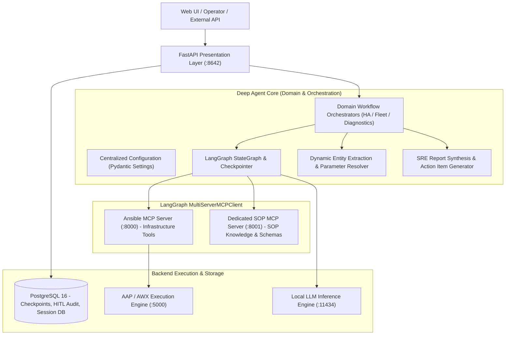
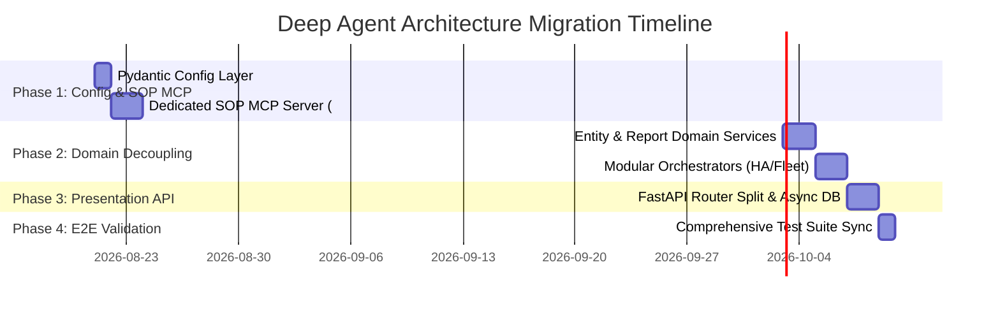

# Architectural Blueprint: Enterprise SOP MCP Server, Domain-Driven Decoupling, & Idiomatic Refactoring

**Author:** Principal Python & DevOps Architect  
**Target System:** Deep Agent Autonomous SRE Platform  
**Scope:** Architecture & Phased Implementation Plan (No execution code generated in this phase)

---

## 1. Executive Summary & Architectural Goals

The Deep Agent platform currently executes multi-cluster Red Hat HA rolling updates, standalone fleet patching, and out-of-band console recoveries across containerized microservices. While operational, the existing implementation exhibits technical debt:
1. **Monolithic Workflow Logic:** `agent_engine.py` mixes entity extraction, workflow sequencing, FastMCP tool binding, error classification, and markdown rendering.
2. **Coupled SOP Knowledge:** Standard Operating Procedures (e.g., Red Hat SOP 2059253) are hardwired into prompt templates and orchestrator functions rather than exposed as modular, discoverable knowledge and execution assets.
3. **Implicit Configuration:** Configuration values, database credentials, and operational thresholds are scattered across `.env` calls, fallback defaults, and inline literals.

This blueprint establishes a **Domain-Driven Architecture (DDD)**, creates a **Dedicated SOP MCP Server**, modernizes the agent workflow using **idiomatic LangGraph / LangChain abstractions**, and centralizes configuration using **Pydantic v2 Settings**.

---

## 2. Architectural Overview & Component Boundaries



---

## 3. Component 1: Dedicated SOP MCP Server Architecture

### 3.1 Server Identity & Discovery
A standalone FastMCP service (`sop-mcp-server`) exposed on port `8001` (HTTP Streamable transport), providing both **MCP Resources** (read-only runbooks) and **MCP Tools** (executable SOP validation, step sequencing, and safety criteria).

### 3.2 URI Scheme & Resources
| Resource URI | Description | MIME Type |
| :--- | :--- | :--- |
| `sop://rhel/ha/2059253` | Red Hat Enterprise Linux HA Rolling Update (Pacemaker / Corosync) | `text/markdown` |
| `sop://rhel/fleet/patching` | Enterprise Fleet Patching & Staged Kernel Lifecycle SOP | `text/markdown` |
| `sop://rhel/recovery/console` | Out-of-band IPMI / Console Hardware Power-On & Diagnostic SOP | `text/markdown` |
| `sop://catalog` | Manifest listing all operational SOPs, risk classifications, and required approvals | `application/json` |

### 3.3 SOP MCP Tool Definitions & Schemas

```json
{
  "tools": [
    {
      "name": "sop_get_procedure",
      "description": "Retrieves the full structured execution graph and prerequisite checklist for a given SOP ID.",
      "parameters": {
        "type": "object",
        "properties": {
          "sop_id": {
            "type": "string",
            "enum": ["RHEL_HA_2059253", "RHEL_FLEET_PATCHING", "RHEL_CONSOLE_RECOVERY"]
          },
          "target_infrastructure": {
            "type": "string",
            "description": "Target clusters or server lists to evaluate against SOP prerequisites"
          }
        },
        "required": ["sop_id"]
      }
    },
    {
      "name": "sop_validate_prerequisites",
      "description": "Evaluates cluster quorum, STONITH health, and active resource groups against SOP safety criteria before execution.",
      "parameters": {
        "type": "object",
        "properties": {
          "sop_id": {"type": "string"},
          "precheck_stdout": {"type": "string"}
        },
        "required": ["sop_id", "precheck_stdout"]
      }
    },
    {
      "name": "sop_generate_execution_plan",
      "description": "Transforms user query and SOP rules into an immutable multi-stage batch execution graph with fallback branches.",
      "parameters": {
        "type": "object",
        "properties": {
          "sop_id": {"type": "string"},
          "entities": {"type": "array", "items": {"type": "string"}},
          "hitl_mode": {"type": "string", "enum": ["enforced", "autonomous"]}
        },
        "required": ["sop_id", "entities"]
      }
    }
  ]
}
```

### 3.4 Structured Error Handling
All SOP tool responses adhere to a typed envelope:
```json
{
  "status": "SUCCESS | PREREQUISITE_FAILED | SAFETY_VIOLATION | EXECUTION_ERROR",
  "sop_id": "RHEL_HA_2059253",
  "stage": "Pre-Check Evacuation",
  "violations": [],
  "remediation_sop": null,
  "data": {}
}
```

---

## 4. Component 2: File Structure & Module Migration Map

### Before vs. After Architecture

```
BEFORE (Coupled / Monolithic)            AFTER (Clean Domain-Driven Modular)
deepagent_system/                        deepagent_system/
├── app/                                 ├── app/
│   ├── config.py (ad-hoc os.getenv)     │   ├── core/
│   ├── agent_engine.py (600+ lines)     │   │   ├── config.py (Pydantic v2 Settings)
│   ├── main.py (750+ lines)             │   │   ├── logging.py (Structured JSON Logger)
│   ├── mcp_client.py                    │   │   └── exceptions.py (Custom SRE Exceptions)
│   └── prompts.py                       │   ├── domain/
│                                        │   │   ├── models/ (Pydantic Domain Schemas)
│                                        │   │   ├── services/
│                                        │   │   │   ├── entity_extractor.py
│                                        │   │   │   ├── report_generator.py
│                                        │   │   │   └── safety_guard.py
│                                        │   │   └── orchestrators/
│                                        │   │       ├── ha_rolling_update.py
│                                        │   │       └── fleet_patcher.py
│                                        │   ├── infrastructure/
│                                        │   │   ├── db/ (Async SQLAlchemy / psycopg3 pool)
│                                        │   │   ├── mcp/
│                                        │   │   │   ├── client.py (MultiServerMCPClient wrapper)
│                                        │   │   │   └── adapters.py
│                                        │   │   └── llm/ (LangGraph / Ollama factory)
│                                        │   └── api/ (FastAPI routers)
│                                        │       ├── v1/ (chat, hitl, settings, threads)
│                                        │       └── main.py (Clean ASGI Entrypoint)
├── mock_aap/                            ├── sop_mcp_server/ (NEW DEDICATED MCP SERVER)
│   └── mock_aap.py                      │   ├── server.py (FastMCP Server :8001)
│                                        │   ├── procedures/ (SOP Markdown & Rule Manifests)
│                                        │   └── schemas/ (SOP Tool Schemas)
└── tests/                               ├── mock_aap/
    ├── test_ha_subagent_multiruns.py    └── tests/
    └── test_randomized_dynamic...           ├── unit/
                                             ├── integration/
                                             └── e2e/
```

---

## 5. Component 3: Configuration & Hardcoding Decoupling

All environment variables and operational thresholds will be managed via a centralized, strictly validated Pydantic model (`app/core/config.py`):

```python
from pydantic_settings import BaseSettings, SettingsConfigDict
from pydantic import Field, HttpUrl, PostgresDsn

class DeepAgentSettings(BaseSettings):
    model_config = SettingsConfigDict(env_file=".env", env_file_encoding="utf-8", extra="ignore")

    # API & Security
    api_port: int = Field(8642, description="Port for Core Agent REST API")
    api_server_key: str = Field("hermes-api-secret", description="API Bearer Token")
    environment: str = Field("production", description="Environment stage: development, test, production")

    # PostgreSQL Database
    database_url: PostgresDsn = Field(
        "postgresql://hermes:secret456@db:5432/hitl",
        description="Async PostgreSQL connection URI"
    )
    db_pool_min_size: int = 5
    db_pool_max_size: int = 20

    # LLM Inference
    ollama_host: HttpUrl = Field("http://ollama:11434", description="Ollama API base URL")
    ollama_model: str = Field("qwen2.5:3b", description="Primary model tag")
    ollama_temperature: float = 0.0

    # MCP Endpoints
    ansible_mcp_url: HttpUrl = Field("http://ansible-mcp:8000/mcp", description="Ansible FastMCP URL")
    sop_mcp_url: HttpUrl = Field("http://sop-mcp:8001/mcp", description="SOP FastMCP URL")

    # Operational Guardrails & Thresholds
    hitl_default_mode: str = Field("enforced", pattern="^(enforced|autonomous)$")
    hitl_approval_window_minutes: int = 15
    reboot_ssh_timeout_seconds: int = 60
    batch_concurrency_limit: int = 10
```

---

## 6. Step-by-Step Phased Execution Plan



### Phase 1: Centralized Configuration & Dedicated SOP MCP Server
- **Objectives:**
  1. Build `app/core/config.py` using `pydantic-settings`.
  2. Implement `sop_mcp_server/server.py` exposing SOP resources (`sop://rhel/ha/2059253`) and validation tools.
  3. Update `docker-compose.yml` / Podman deployment to include `deepagent-sop-mcp` on port `8001`.
- **Validation Check:**
  - `curl http://localhost:8001/mcp` responds with streamable FastMCP session.
  - MultiServerMCPClient loads tools from both `:8000` (Ansible) and `:8001` (SOP).
- **Rollback Point:** Revert container configuration to single MCP endpoint.

### Phase 2: Domain Services & Orchestration Modernization
- **Objectives:**
  1. Extract dynamic regex/range parser into `app/domain/services/entity_extractor.py`.
  2. Extract markdown table and incident synthesis into `app/domain/services/report_generator.py`.
  3. Create typed domain orchestrators in `app/domain/orchestrators/` leveraging native LangGraph StateGraph nodes.
- **Validation Check:**
  - Unit test suite passes for entity extraction across 50+ random prompt patterns.
  - Report generator produces clean tables and action items from mock tool envelopes.
- **Rollback Point:** Git checkpoint before domain restructuring.

### Phase 3: FastAPI Routing & Database Layer Refactor
- **Objectives:**
  1. Split monolithic `main.py` into modular routers: `api/v1/chat.py`, `api/v1/hitl.py`, `api/v1/settings.py`, `api/v1/threads.py`.
  2. Replace raw `psycopg2` synchronous connections with connection pooling (`psycopg_pool` / asyncpg).
  3. Isolate SSE streaming handler into reusable streaming pipeline.
- **Validation Check:**
  - REST endpoints (`/v1/chat/completions`, `/v1/hitl/pending`, `/v1/hitl/resolve`, `/v1/settings/hitl_mode`) maintain 100% backward compatibility.
- **Rollback Point:** Revert `main.py` router bindings.

### Phase 4: Full-Suite Verification & CI/CD Packaging
- **Objectives:**
  1. Update `tests/test_randomized_dynamic_scenarios.py` to query SOP tools dynamically.
  2. Execute master test suite `run_deepagent_tests.py` across all 8 stages.
  3. Execute multi-run verification suites (`test_ha_subagent_multiruns.py`, `test_fleet_subagent_multiruns.py`).
- **Validation Check:**
  - 100% pass rate across randomized fleet tests (sizes 3–15, clean runs, soft-hang recoveries, DNF errors).
- **Rollback Point:** Revert to previous release branch.

---

## 7. Open Risks, Assumptions, and Prerequisites

### Assumptions
1. The local inference engine (`ollama` running `qwen2.5:3b`) will continue executing tool-calling reliably when exposed to multi-server MCP environments.
2. The airgapped Podman environment has container ports `8001` available for the new SOP MCP server.

### Identified Risks & Mitigations
| Risk | Severity | Mitigation Strategy |
| :--- | :--- | :--- |
| **Small Model (3B) Tool Confusion:** Providing too many MCP tools from multiple servers could degrade LLM parameter extraction. | **High** | Tool filtering & subagent specialization: `ha-cluster-patcher` only receives HA tools + HA SOP tools; `fleet-patcher` only receives fleet tools. |
| **SSE Streaming Latency:** Modular router transitions could introduce buffering delays in UI event stream. | **Medium** | Use explicit `flush=True` and FastAPI `StreamingResponse` with `asyncio.Event` streaming buffers. |
| **Database Migration Locking:** Transitioning connection pools during live testing. | **Low** | Perform schema validations without destructive DDL. |

---

## 8. Approval & Next Steps
This plan represents the architectural target state. Once approved, implementation will proceed starting with **Phase 1: Centralized Configuration & Dedicated SOP MCP Server**.
