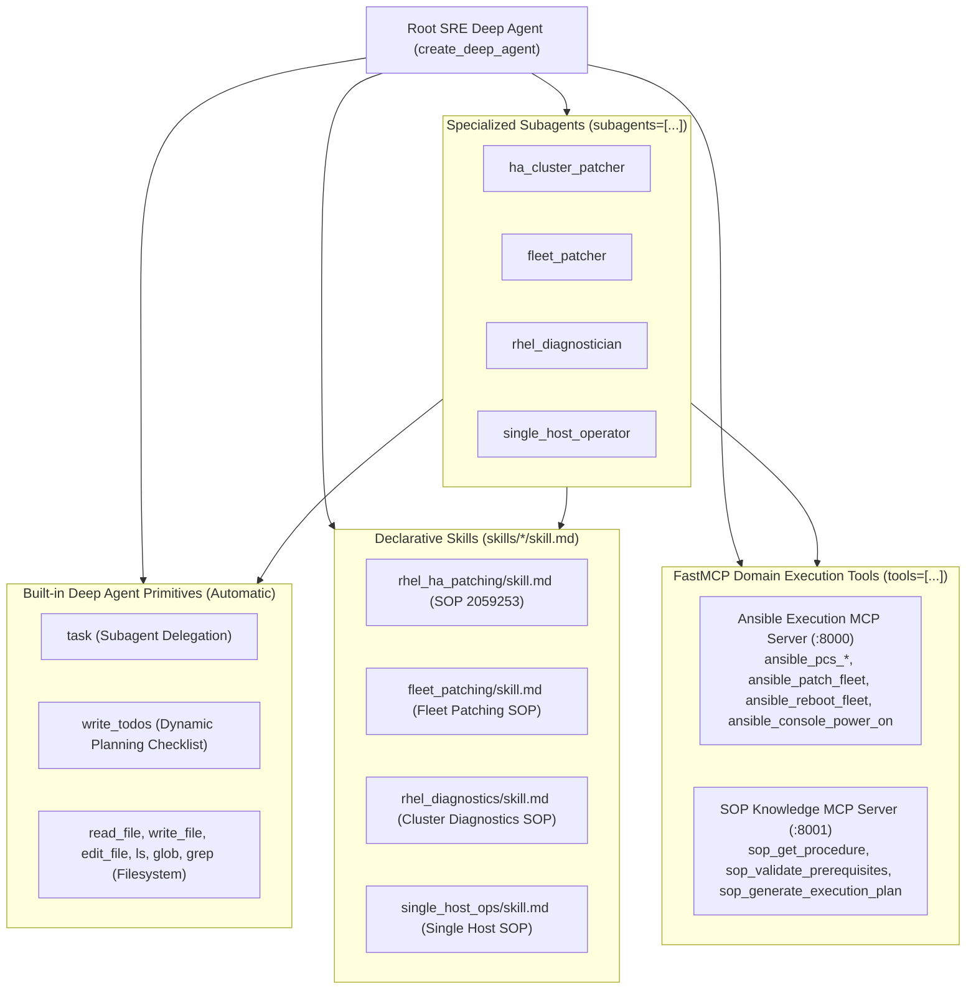

# Architecture & Refactoring Plan: Pure LangChain Deep Agent Architecture (Updated with Built-in Tool Safety)

## 1. Architectural Mandates & Core Principles

This plan establishes a **100% pure Deep Agent architecture** strictly aligned with the official LangChain Deep Agents specification (`deepagents`, `create_deep_agent`), with strict guarantees against duplicate/colliding tool registrations.

### 1.1 Built-in Tool Separation & Zero Collisions:
- **`create_deep_agent(...)` Built-in Primitives**:
  - **Filesystem Tools**: `ls`, `read_file`, `write_file`, `edit_file`, `glob`, `grep` are provided natively by Deep Agents (`FilesystemMiddleware`).
  - **Planning Tool**: `write_todos` is provided natively by Deep Agents (`TodoListMiddleware`).
  - **Delegation Tool**: `task` is provided natively by Deep Agents (`SubAgentMiddleware`).
- **FastMCP Role (Domain Infrastructure Only)**:
  - The FastMCP servers (`deepagent-ansible-mcp:8000` and `deepagent-sop-mcp:8001`) supply **ONLY domain execution and compliance tools** (`ansible_pcs_*`, `ansible_patch_fleet`, `ansible_reboot_fleet`, `ansible_check_host_online`, `ansible_console_power_on`, `ansible_send_email`, `sop_get_procedure`, `sop_validate_prerequisites`, `sop_generate_execution_plan`).
  - **NO duplicate filesystem tools** (`read_file`, `write_file`, `list_dir`) are registered via FastMCP to prevent schema collisions and LLM confusion.

### 1.2 Absolute Prohibition on Hardcoded Workflows:
- **NO** hardcoded procedural workflows or mock step counters in Python code.
- **NO** script-based faking of `todos = [...]` or mock progress dictionaries.
- All legacy orchestrators remain isolated in [`deepagent_system/legacy_orchestrators_backup/`](file:///home/fayez/agent2/deepagent_system/legacy_orchestrators_backup/) as an untouched archive.

---

## 2. Component Architecture & Tool Registry



---

## 3. Implementation Phases

### Phase 1: Declarative Skills Verification (`skills/*/skill.md`)
Ensure all SOPs exist exclusively as declarative markdown files with YAML frontmatter under `deepagent_system/skills/`:
- `skills/rhel_ha_patching/skill.md`: Red Hat HA Rolling Update SOP 2059253.
- `skills/fleet_patching/skill.md`: Standalone Fleet Patching & IPMI Recovery.
- `skills/rhel_diagnostics/skill.md`: Non-disruptive cluster health checks & log triage.
- `skills/single_host_ops/skill.md`: Single-server package installation, filesystem expansion, and reboots.

---

### Phase 2: Native Deep Agent Engine (`app/agent_engine.py`)
Configure [`app/agent_engine.py`](file:///home/fayez/agent2/deepagent_system/app/agent_engine.py):
1. **Pass Domain Execution Tools Only**:
   - Filter `tools = await load_mcp_tools()` to ensure only domain FastMCP tools are passed into `create_deep_agent(tools=domain_tools)`.
   - Built-in filesystem tools (`read_file`, `write_file`, `edit_file`, `ls`), built-in planning (`write_todos`), and delegation (`task`) are supplied automatically by `create_deep_agent`.
2. **Subagents Declaration**:
   - `ha_cluster_patcher`
   - `fleet_patcher`
   - `rhel_diagnostician`
   - `single_host_operator`
3. **Progressive Disclosure Skills**:
   - `skills=["/app/skills/"]`

---

### Phase 3: Streaming & Event Interception in FastAPI Chat Router (`app/api/v1/chat.py`)
Stream directly from `agent.astream(..., stream_mode="updates")`:
1. **Intercept Planning Tool (`write_todos`)**:
   When the LLM calls the native `write_todos` tool, emit:
   ```json
   {"event": "step", "step": {"step_type": "planning", "tool_name": "write_todos", "todos": tool_call["args"]["todos"]}}
   ```
2. **Intercept Built-in Filesystem Tools (`read_file`, `ls`, `write_file`)**:
   When the LLM reads a skill file via `read_file`, emit:
   ```json
   {"event": "step", "step": {"step_type": "filesystem", "tool_name": tool_call["name"], "file_path": tool_call["args"].get("path") or tool_call["args"].get("file_path")}}
   ```
3. **Intercept Subagent Delegation (`task`)**:
   When the root agent delegates to a subagent, emit:
   ```json
   {"event": "step", "step": {"step_type": "subagent_delegation", "tool_name": "task", "target_subagent": tool_call["args"].get("subagent_type")}}
   ```
4. **Intercept FastMCP Execution Tools**:
   Emit standard tool step with HITL enrichment.

---

### Phase 4: Frontend Live Plan & Filesystem Rendering (`web_ui/app.js` & `style.css`)
Update [`web_ui/app.js`](file:///home/fayez/agent2/deepagent_system/web_ui/app.js) and [`web_ui/style.css`](file:///home/fayez/agent2/deepagent_system/web_ui/style.css):
1. **Live TODO Checklist Card (`.planning-card`)**:
   - Detects `step_type === "planning"` / `tool_name === "write_todos"`.
   - Updates the live checklist widget in-place in the chat stream.
   - Dynamic badges: 🔄 `in_progress`, ✅ `completed`, ⏳ `pending`, ❌ `failed`.
2. **Filesystem Inspector Card (`.fs-card`)**:
   - Detects `step_type === "filesystem"` or built-in filesystem tool calls.
   - Displays a distinct card with badge `📂 FILESYSTEM`, action icon, file path, and syntax-highlighted content snippet.
3. **Collapsible FastMCP Trace Cards**:
   - Chronological tool traces with permanent in-pane HITL authorization records.

---

### Phase 5: Verification & End-to-End Testing
1. Sync all updated files into rootless Podman containers.
2. Execute the Master Test Harness:
   ```bash
   python3 /home/fayez/agent2/deepagent_system/tests/run_all_verification_tests.py
   ```
3. Ensure all 7 verification test suites pass with a **100% success rate**.
4. Update documentation in `docs/` to reflect the built-in tool separation.
5. Commit and push the changes to GitHub.
