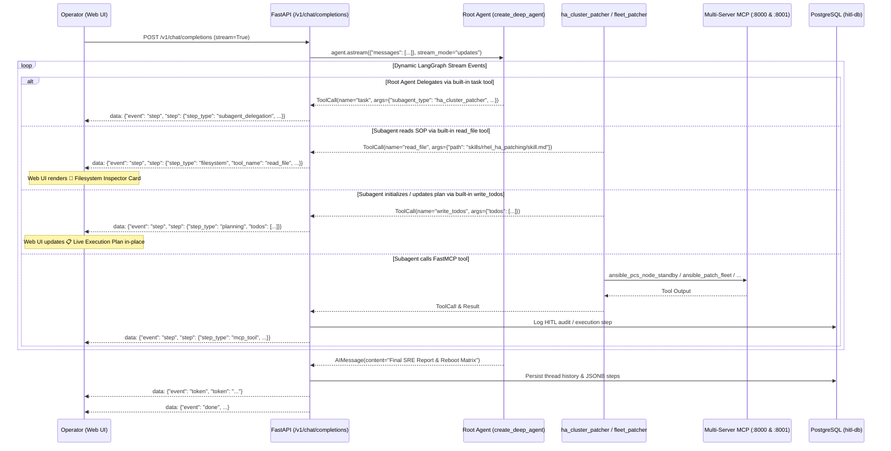

# Revised Plan: Pure LangGraph Deep Agent Native Streaming & Planning

---

## 1. Architectural Guardrails & Principles

We strictly eliminate all procedural scripts and legacy orchestrator dispatchers. The agent will run **100% natively via the LangGraph Deep Agent compiled graph (`create_deep_agent`)**.

### Key Tenets:
1. **Zero Procedural Dispatchers**:
   - `app/domain/orchestrators/` is removed from active code paths and remains archived in `deepagent_system/legacy_orchestrators_backup/`.
   - `app/api/v1/chat.py` will **NOT** call `WorkflowDispatcher` or any hardcoded Python classes.
2. **Pure LLM-Driven Execution Loop**:
   - All tool invocations, subagent delegations, progressive disclosure skill reads, and task planning originate organically from the LLM via `agent.astream(..., stream_mode="updates")`.
3. **Native Tool Interception & Event Streaming**:
   - The FastAPI SSE stream (`/v1/chat/completions`) intercepts real LangGraph graph nodes and messages.
   - Built-in `write_todos` calls ➔ dispatched as `step_type: "planning"`.
   - Built-in `read_file` calls ➔ dispatched as `step_type: "filesystem"`.
   - Built-in `task` delegation calls ➔ dispatched as `step_type: "subagent_delegation"`.
   - FastMCP infrastructure calls ➔ dispatched as `step_type: "mcp_tool"`.
4. **Live Interactive Web UI**:
   - The Web UI dynamically renders the **📋 Live Execution Plan (TODOs)** widget in-place upon receiving `write_todos`.
   - The Web UI renders the **📂 Filesystem Inspector Card** upon receiving `read_file` when the agent consults SOP skills.

---

## 2. Sequence Diagram: Pure Native Deep Agent Execution



---

## 3. Detailed Implementation Steps

### Phase 1: Pure Agent Initialization & Prompts ([`app/agent_engine.py`](file:///home/fayez/agent2/deepagent_system/app/agent_engine.py))
1. Configure `init_deep_agent()`:
   - Root agent instantiated via `create_deep_agent(...)`.
   - Domain FastMCP tools supplied from `:8000` and `:8001` (zero duplicate filesystem tools).
   - Skills directory passed as `skills=["/app/skills/"]`.
   - Subagents configured:
     - `ha_cluster_patcher`: Instructed to first use `read_file` to read `skills/rhel_ha_patching/skill.md`, call `write_todos` to initialize the 9-stage SOP checklist, and advance tasks to `completed` as FastMCP tools return.
     - `fleet_patcher`: Instructed to first use `read_file` to read `skills/fleet_patching/skill.md`, call `write_todos` to initialize the 6-stage fleet checklist, and advance tasks to `completed`.
     - `rhel_diagnostician`: Uses `read_file` to read `skills/rhel_diagnostics/skill.md` and runs diagnostic checks.
     - `single_host_operator`: Uses `read_file` to read `skills/single_host_ops/skill.md` for single-node actions.
2. Remove all references to `execute_subagent_workflow_orchestrator` or `WorkflowDispatcher`.

---

### Phase 2: Native Stream Interception in FastAPI Chat Router ([`app/api/v1/chat.py`](file:///home/fayez/agent2/deepagent_system/app/api/v1/chat.py))
Refactor `app/api/v1/chat.py` to stream directly from the compiled LangGraph agent graph:

```python
agent = await get_agent()
intermediate_steps = []
final_response_text = ""

async for event in agent.astream({"messages": [{"role": "user", "content": user_query}]}, stream_mode="updates"):
    for node_name, node_output in event.items():
        messages = node_output.get("messages", [])
        for msg in messages:
            # 1. Intercept Tool Invocations
            if hasattr(msg, "tool_calls") and msg.tool_calls:
                for tc in msg.tool_calls:
                    t_name = tc.get("name")
                    t_args = tc.get("args", {})
                    
                    if t_name == "write_todos":
                        step = {
                            "step_type": "planning",
                            "tool_name": "write_todos",
                            "tool_args": t_args,
                            "todos": t_args.get("todos", [])
                        }
                    elif t_name in ["read_file", "write_file", "edit_file", "ls", "list_dir"]:
                        step = {
                            "step_type": "filesystem",
                            "tool_name": t_name,
                            "tool_args": t_args,
                            "file_path": t_args.get("path") or t_args.get("file_path") or t_args.get("target_file")
                        }
                    elif t_name == "task":
                        step = {
                            "step_type": "subagent_delegation",
                            "tool_name": "task",
                            "target_subagent": t_args.get("subagent_type") or t_args.get("name"),
                            "tool_args": t_args,
                            "subagent_task_prompt": t_args.get("description") or t_args.get("task")
                        }
                    else:
                        step = {
                            "step_type": "mcp_tool",
                            "tool_name": t_name,
                            "tool_args": t_args
                        }
                    
                    step = enrich_step_with_hitl(step)
                    intermediate_steps.append(step)
                    yield f"data: {json.dumps({'event': 'step', 'step': step})}\n\n"
                    await asyncio.sleep(1.2)  # Pacing for visual observation

            # 2. Intercept Tool Results
            elif getattr(msg, "type", "") == "tool" or msg.__class__.__name__ == "ToolMessage":
                if intermediate_steps:
                    intermediate_steps[-1]["tool_output"] = str(msg.content)

            # 3. Intercept Final Assistant Synthesis
            elif getattr(msg, "type", "") == "ai" or msg.__class__.__name__ == "AIMessage":
                if msg.content and not msg.tool_calls:
                    final_response_text = str(msg.content)
```

---

### Phase 3: Web UI Component Verification ([`web_ui/app.js`](file:///home/fayez/agent2/deepagent_system/web_ui/app.js))
- The Web UI is already equipped with `.planning-card` and `.fs-card` DOM rendering.
- When real `write_todos` events arrive, `app.js` updates `.planning-card` in-place, rendering:
  - 🔄 `in_progress` (pulse ring)
  - ✅ `completed` (green strikethrough)
  - ⏳ `pending` (dimmed)
  - ❌ `failed` (red incident)
- When `read_file` events arrive, `app.js` renders the `.fs-card` showing the SOP skill path being accessed.

---

### Phase 4: Verification & Test Harness Execution
1. Deploy updated `app/agent_engine.py`, `app/prompts.py`, `app/api/v1/chat.py`, and `web_ui` into Podman containers.
2. Execute the Master Test Harness:
   ```bash
   python3 /home/fayez/agent2/deepagent_system/tests/run_all_verification_tests.py
   ```
3. Verify that all 7 test suites pass with a **100% success rate**.
4. Test directly via browser/curl to confirm that live `write_todos` checklist cards and `read_file` filesystem inspector cards render cleanly in the UI.
5. Commit and push the changes to GitHub.
